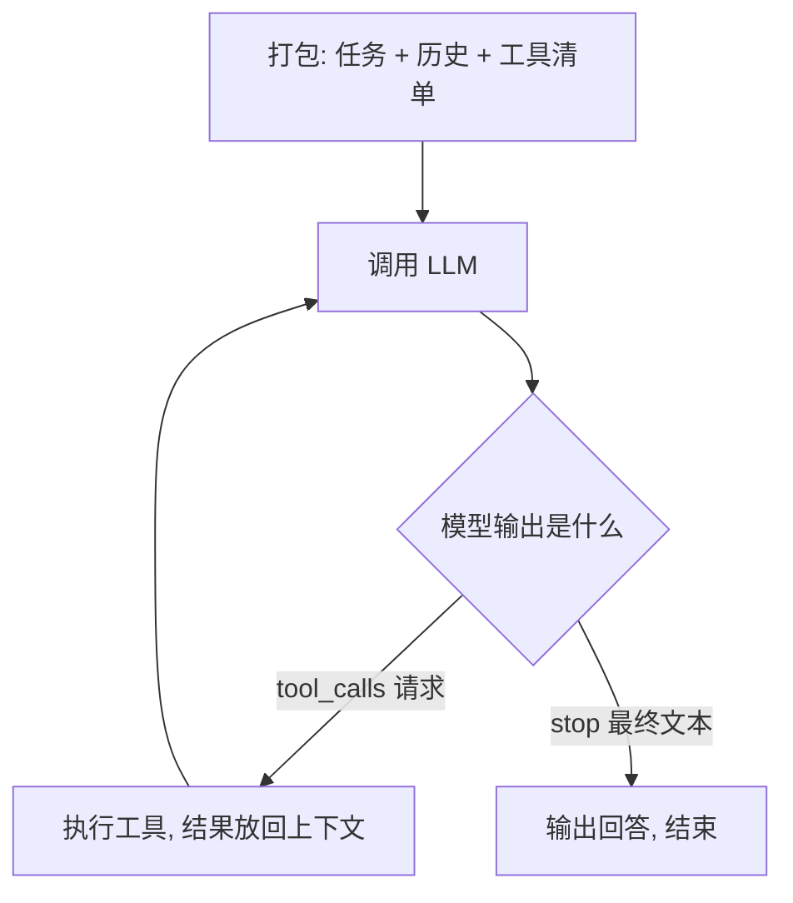

# 第 1 篇 · LLM 与 Agent 基础

> **难度**：⭐⭐（会写 Python/JS 即可）
> **本篇目标**：把 Agent 的底层机制**讲透**——不只是"怎么调 API"，而是"为什么模型会这样做、上下文为什么有限、工具调用为什么能工作"。代码只保留最能说明原理的核心片段。

---

## 1. 先搞懂 LLM 在做什么

### 1.1 Token 化：模型不是"读字"，是"读符号"

大语言模型（LLM）的输入输出单位不是字符，而是 **token**——文本被分词器切成的小块。主流模型使用 **BPE（字节对编码）**：从单字符开始，反复把"出现频率最高的相邻字符对"合并成一个新符号，直到达到预设词表大小。

```text
原始文本: h e l l o   w o r l d
合并高频对 → [hello] [ world]    ← 常见词/子词成为一个 token
```

三个直接后果，每一个都影响你的工程决策：

1. **计费按 token**：输入+输出 token 数 × 单价 = 成本（第 4 篇的成本控制全靠它）；
2. **上下文上限是 token 数**：128K 上下文 ≈ 8~10 万汉字，不是字符数；
3. **KV 缓存按 token 复用**：前缀 token 序列不变才能命中缓存（见 1.3）。

> 中文大约 1~2 个汉字 = 1 个 token；代码的缩进、常见关键字是高频对，会形成专用 token——这解释了为什么代码类 token 密度高、模型擅长代码。

### 1.2 生成过程：为什么模型是"概率分布"而不是"查字典"

LLM 的核心是一个条件概率分布：给定前面所有 token，预测下一个 token 的概率。**关键认知：这不是检索，是采样**——模型输出的每个字都是从分布中抽出来的：

```text
P(next | "今天天气") → { "真": 0.4, "很": 0.3, "不错": 0.2, ... }
采样 → "很"
P(next | "今天天气很") → { "好": 0.5, ... } → "好"
输出："今天天气很好"
```

两个参数决定了这个分布的"形状"：

| 参数 | 作用 | 直觉 |
|---|---|---|
| `temperature` | 分布尖锐度（0~1） | 越低越"只选最可能"，越高越"敢于冒险" |
| `top_p` | 只从累积概率 top_p 的 token 里采样 | 砍掉长尾低概率 token，防止"胡说" |

> **为什么这决定工程行为**：写代码用低 temperature（0~0.3，确定性优先）；评测必须固定 temperature=0（可复现，第 4 篇评测的硬要求）。**"模型会随机"不是 bug，是机制**——这也是为什么 Agent 需要重试、反思和评测。

### 1.3 上下文窗口与 KV 缓存：Agent 工程的物理定律


**一个直觉类比**：注意力机制像**手电筒在黑暗房间里找东西**——内容越多（房间越大），手电筒的光束越分散，每件物品被照到的注意力越弱。这就是为什么上下文越长，模型越“记不住”早期内容：不是它“忘了”，是注意力被摊薄了。

**上下文窗口** = 模型一次推理能"看到"的 token 上限。它为什么存在？因为模型内部是**注意力机制**：每个 token 都要与前面所有 token 计算相关性，上下文越长，计算量越大、信息越被"稀释"（注意力被摊薄）。这是**物理限制**，不是工程偷懒。

**KV 缓存**是推理引擎的优化：生成时每个 token 的注意力中间状态（Key/Value）被缓存，**只要请求前缀的 token 序列不变，前缀状态直接复用**：

```text
请求 A: [system][工具描述][历史] [新问题]   ← 前缀被缓存
请求 B: [system][工具描述][历史] [新问题']  ← 前缀相同 → 命中缓存（省钱省时）
请求 C: [system][工具描述改一个字][历史]... ← 前缀变了 → 缓存全部失效
```

**KV 缓存类比**：像**备菜**——请求 A 时已经把“system + 工具描述 + 历史”全部切好洗净（算好 Key/Value）；请求 B 只是加了句新问题，直接下锅（复用缓存）；但如果你改动前缀的任何一个字，等于把已备好的菜倒掉重新切（缓存全失效）。所以生产框架把提示词前缀当作“神圣不可侵犯”的区域。

> **工程启示（生产框架都在为它优化）**：提示词前缀要**稳定**——工具描述顺序固定、文本确定、历史只追加不修改。DSH 的 SDK 生成"字典序、逐字节确定"就是为了这个（第 3 篇详述）。

### 1.4 一次真实的 API 调用

用 OpenAI SDK 调 DeepSeek 模型（协议兼容）：

```python
# pip install openai
from openai import OpenAI
client = OpenAI(api_key="sk-...", base_url="https://api.deepseek.com")

resp = client.chat.completions.create(
    model="deepseek-chat",
    messages=[{"role": "user", "content": "1 + 1 = ?"}],
    temperature=0.2,
)
print(resp.choices[0].message.content)   # 答案
print(resp.usage)                        # token 统计（计费依据）
```

注意响应里的 `finish_reason` 字段——它只有几个取值（`stop` / `length` / `tool_calls` / `content_filter`），**它就是 Agent 循环的"信号灯"**：下一节会看到，模型决定调用工具时，这个字段会变成 `tool_calls`。

> **练习 1.1**：跑通上面代码，打印完整响应 JSON，观察 `finish_reason` 与 `usage`。

## 2. 什么是 Agent？

> **Agent（智能体）** = LLM（大脑）+ 工具（手脚）+ 循环（编排）

拆开看三个词的含义：

- **大脑**：LLM 负责理解、推理、决策——但它**只会输出文本**；
- **手脚**：工具是你注册给模型的可调用函数——执行代码、读写文件、搜索网页；
- **编排**：循环代码把两者串起来——这是 99% 的"智能"实际发生的地方，也是你（开发者）唯一完全掌控的部分。

Agent 循环的核心只有四步：



**最重要的心智模型**：模型本身不执行任何东西。它只输出两种东西之一——普通文本（`finish_reason: stop`，最终回答）或工具调用请求（`finish_reason: tool_calls`）。执行永远发生在你的代码里。这个认知贯穿全部后续内容。

> 一个真实回合的 trace（"把 123 和 456 相加再乘 2"）：第 1 次请求 → 模型要 `add(123,456)` → 你执行得 579 → 回填 → 第 2 次请求 → 模型要 `multiply(579,2)` → 回填 → 第 3 次请求 → 输出 1158。**三次完整往返**——这就是为什么多步任务慢，也是 PTC 模式（第 3 篇）存在的理由。

## 3. 函数调用（Function Calling）：Agent 的地基

### 3.1 本质：工具调用也是"文本生成"

先建立一个反直觉但关键的认知：**模型请求调用工具，本质上仍然是生成了一段文本**——只是这段文本恰好符合我们定义的 JSON 格式。模型看到工具描述（一段文本），基于任务生成"我想调 get_weather，参数是 {city: 北京}"（一段 JSON 文本）。**模型没有执行任何东西，也感知不到工具的"真实"存在**。

这个认知解释了两个现象：
- **模型会"幻觉"参数**（编造不存在的城市名）——因为它只是按概率续写文本；
- **工具描述的质量直接决定调用质量**——描述是模型对工具唯一的认知来源。

### 3.2 三阶段机制

**阶段一：告诉模型"你有什么工具"**——每个工具是一个 JSON Schema 描述（模型看到的是这段文本）：

```python
tools = [{
    "type": "function",
    "function": {
        "name": "get_weather",
        "description": "查询指定城市的当前天气",   # ← 模型靠它做决策
        "parameters": {
            "type": "object",
            "properties": {"city": {"type": "string"}},
            "required": ["city"],
            "additionalProperties": False,          # 防止发明字段
        },
    },
}]
```

**阶段二：模型返回调用请求**——注意 `finish_reason: "tool_calls"` 与 `arguments` 是 **JSON 字符串**（必须 parse 才能用）：

```json
{
  "choices": [{
    "finish_reason": "tool_calls",
    "message": {
      "role": "assistant", "content": null,
      "tool_calls": [{
        "id": "call_abc123",                    // ← 回填时要对应
        "function": { "name": "get_weather",
                      "arguments": "{\"city\": \"北京\"}" }
      }]
    }
  }]
}
```

**阶段三：你执行，结果回填**——结果作为 `role: "tool"` 消息、携带 `tool_call_id` 追加回消息数组，再次请求：

```python
messages.append({"role": "tool", "tool_call_id": "call_abc123", "content": "{\"temp\": 25}"})
resp = client.chat.completions.create(model=..., messages=messages, tools=tools)
```

模型看到结果后可继续思考、继续调用，直到 `finish_reason: stop`。

> **练习 1.2**：给模型 `add` 和 `multiply` 两个工具，问"计算 (2+3)*4"。观察需要几轮——这就是多步工具调用，是所有 Agent 的雏形。

### 3.3 工程要点（踩坑总结）

1. **arguments 是字符串**：必须 `json.loads` 解析，且要处理解析失败（模型可能给非法 JSON）；
2. **一次响应可能多个 tool_calls**：循环要支持并行执行——**只读调用可并发，写操作串行**（生产框架的调度契约，DSH 的实现见第 3 篇 5.5）；
3. **失败处理的正道**：把错误作为工具结果回填（`result = f"ERROR: {e}"`），**让模型看到错误自己纠正**——这是 Agent 框架的标准做法，比代码里硬重试更有效；
4. **工具数量控制**：一个 Agent 可见工具建议 ≤ 20 个，多了模型"选择困难"甚至忽略工具；
5. **描述第一句要点题**：`"查询指定城市的当前天气，当用户问天气时使用"` 优于 `"天气工具"`。

### 3.4 工具与 Provider 的工程规范

> 本节整合自 Tritium《Build An Agent From Scratch》[2.5] 篇（CC BY-NC-SA，https://www.tritium.work）。

当 Agent 从教学玩具走向真实世界（读文件、跑命令、搜网页），工具设计有两条工程规范，直接决定稳定性：

**规范一：工具要有“边界意识”。** 真实世界的工具输出动辄几千行（源码、构建日志、网页正文）。生产工具的标配是：

- 读文件工具支持 **offset/limit**（分页读），并在描述里提醒模型“大文件要继续用 offset 读”；
- shell 工具支持 **timeout**，超时**杀整个进程树**（不能只杀父进程），stdout/stderr 流式累积；
- 所有工具输出做 **truncation**（截断）——这是上下文的第一道防线，在 Context Engine 之前就控制体积。

**规范二：Provider 是边界，不是循环的一部分。** 多模型支持的正确形态：Agent Loop 只依赖一个统一的 LLM Client 接口；OpenAI Responses / Chat Completions / Anthropic 等具体适配各自实现该接口，独立承载鉴权、重试、超时、流式。**Loop 不关心 API 差异**——这让你可以在不同模型间切换而不改循环代码。

> 这两个规范在 DSH 里都有对应物：工具 schema 契约（第 3 篇）与 model route 的宿主平面职责（第 4 篇 4.0）。

## 4. 经典架构模式：如何组织多轮调用

函数调用是"原子操作"，架构模式是"组合方式"。四种模式按复杂度递进：

### 4.1 ReAct（推理 + 行动交替）——最经典

让模型在上下文里"自言自语"（Thought），再调工具（Action），看到结果（Observation）继续。**推理文本保留在上下文里**是灵魂——既帮模型保持连贯，也让人类能审计它在想什么：

```text
Thought: 我需要先知道两个城市的纬度再比较。
Action: geocode(city="Paris")
Observation: 48.8566° N
Thought: 巴黎 48.86°N，查伦敦。
Action: geocode(city="London")
Observation: 51.5074° N
Final: 伦敦（51.5°N）比巴黎（48.9°N）高。
```

### 4.2 Plan-and-Execute（先规划再执行）——控制复杂任务

ReAct 走一步看一步，复杂任务易迷失。改进：先让模型**一次性产出完整计划**，再逐步执行、按需修订。DSH 的 **plan mode** 就是它的工程化：先只读探索 → 产出计划 → **人工审批** → 才允许改文件（第 3 篇详述）。

### 4.3 Reflexion（反思重试）——提高成功率

失败后让模型**分析失败原因、写进上下文、再重试**：

```python
for attempt in range(3):
    result = run_agent(task)
    if success(result): return result
    reflection = ask_model(f"上次失败：{result.error}，分析原因并给出修正方案")
    history.append(f"[反思] {reflection}")
```

### 4.4 2026 年生产 Agent 循环的标准形态

```text
规划(Plan，复杂任务先出计划，可修订)
  → 执行循环(Thought → Action → Observation；失败插 Reflection；上下文过大触发 Compaction)
  → 交付(结构化输出 + 必要时人工确认)
```

DSH 的实现就是这张图的工程化：计划模式、agent loop、压缩（Compaction）、目标（长任务）、审批。**先把这张图看懂，后面每一篇都在往图里填实现细节。**

### 4.5 Planner：把计划从“文字”变成“状态机”

> 本节整合自 Tritium《Build An Agent From Scratch》[5] 篇（CC BY-NC-SA，https://www.tritium.work）。

4.2 的 Plan-and-Execute 讲的是思想；这里讲工程化。长任务（如“阅读仓库、对照前文、写出第五章并落盘”）有三个典型失败模式：

1. **任务漂移**：执行几轮后注意力被最近的工具结果牵着走，忘记最初目标（写着写着变成只总结代码）；
2. **假完成**：模型输出一个看起来很完整的 final answer，其实漏掉了关键环节（没核对、没验证就宣布完成）；
3. **重复劳动**：读过的文件、跑过的命令没有被记录成结构化进度，过几轮又重新检查一遍——不是笨，是缺一本“任务账本”。

**核心转变：计划不能只是一段 assistant message**——它可能被 Context Engine 压缩、没有机器可检查的步骤状态、不能阻止模型提前结束、无法表达“这个步骤完成的证据是什么”。计划必须是 Harness 里的一个**任务状态机**：

```text
User goal → 创建显式计划(Plan) → 审批(Review，计划创建后暂停等用户批准)
→ 每轮推进当前步骤(Solve，基于工具 observation 更新状态)
→ 计划不成立时显式修改(Replan) → 完成条件满足才停止
```

四个组件缺一不可：**状态层**（objective/steps/current step/完成条件）、**计划工具**（创建/读取/修改/审批）、**动态计划快照**（每轮把当前 plan 注入 request view）、**Final Answer Guard**（计划仍有未完成步骤时阻止模型提前收尾）。

> 对照四层模型理解各模块分工：chat history = 发生过什么；memory = 哪些事实值得保留；context engine = 本轮该看什么；**planner = 目标是什么、当前做到哪一步、凭什么说完成了**。四个加起来，Agent 才从“会用工具的聊天窗口”变成“能完成长任务的系统”。DSH 的 plan mode 正是这套思想的工程实现（第 3 篇 §8.1）。

## 5. 记忆与上下文管理：Agent 最大的工程挑战

### 5.1 问题本质：上下文是"物理定律"

回到 1.3 的认知：上下文窗口有限是注意力的物理限制。Agent 每轮都会把工具结果塞回上下文，**对话越长，可用窗口越少，token 成本越高**。这不是优化问题，是"内存有限"问题——所以叫"记忆管理"。三种主流策略各有其原理与代价：

### 5.2 策略一：截断（Truncation）——最便宜，最危险

原理：直接丢旧消息。代价：**早期关键信息可能被丢掉**（任务定义、用户偏好）。工程改进是"分层保留"——系统提示词和任务定义永远在，只剪对话历史：

```python
KEEP = 4   # 开头保留条数
messages = messages[:KEEP] + messages[-16:]
```

### 5.3 策略二：压缩（Compaction）——主流方案

原理：用模型把旧对话**总结成摘要**替换原文——"记忆"变成了"笔记"。代价：摘要会丢细节（精确数字、工具输出），所以生产框架只压缩"不重要的旧历史"，工具结果单独走"修剪"（砍头留尾，DSH 参数：超过 8192 字符才修剪，保留头 4096 + 尾 1024 字符——头部通常含结构，尾部通常含结论）。

### 5.4 策略三：检索（RAG）——知识问答的标配

原理：把资料切块 → 向量化 → 查询时只把**最相关的几块**放进上下文。这是"记忆"的第三种形态：**不记全部，记索引**。最小实现（15 行）：

```python
import numpy as np
def embed(texts):  # 调 embedding API
    r = client.embeddings.create(model="text-embedding-3-small", input=texts)
    return [d.embedding for d in r.data]

chunks = split_markdown("docs.md")          # 离线切块
vecs = np.array(embed(chunks))              # 每块一个向量

def retrieve(query, k=3):                   # 在线检索 top-k
    qv = np.array(embed([query])[0])
    return [chunks[i] for i in np.argsort(vecs @ qv)[-k:][::-1]]
```

RAG 的三个坑（2026 年共识）：切块粒度（500~1000 字符较稳）、检索质量（先召回再精排）、**来源标注**（回答必须可溯源，合规必需）。

### 5.5 记忆的类型学（进阶视野）

| 记忆类型 | 载体 | 例子 | 工程实现 |
|---|---|---|---|
| 工作记忆 | 上下文窗口 | 当前任务中间结果 | 对话历史（不落地） |
| 长期记忆 | 外部存储 | 用户偏好、项目背景 | 向量库/数据库 + 检索 |
| 程序性记忆 | 代码/配置 | "这类 bug 怎么修" | 工具、Skills、预设（DSH 的 skills 机制） |

### 5.6 上下文引擎：从“三板斧”到“六层架构”

> 本节整合自 Tritium《Build An Agent From Scratch》[3] 篇（CC BY-NC-SA，https://www.tritium.work）。

5.2~5.4 的三板斧是“单点手段”。真实生产系统需要把它们组织成一条**流水线**——这就是**上下文引擎（Context Engine）**。它有两个前提设计：

**设计一：历史与视图分离**。Agent 自己的完整消息历史（history）是**事实记录**，不能破坏；模型真正看到的（request-view）是**工作视图**，可以被截断、压缩、替换和重排。两个实体分离，压缩才敢放手做。

**设计二：六层流水线**。在 Agent Loop 把消息发给 LLM 之前，经过六道处理：

```text
完整 history → ① Prompt Builder → ② Token 估算 → ③ Budget Manager →
④ 启发式压缩 → ⑤ Handoff Summary → ⑥ Dynamic Compression → request-view → LLM
```

| 层 | 职责 | 关键点 |
|---|---|---|
| ① Prompt Builder | 把稳定提示词拼成结构化前缀 | 按变化频率排序；环境背景渲染成 XML（含 cwd/日期/时区/shell），工具列表也结构化——降低模型的“解析成本” |
| ② Token 估算 | 让上下文有共同度量 | 不追求精确 tokenizer，用稳定低成本的经验公式近似（按字符数估算即可）——够用于预算决策 |
| ③ Budget Manager | 决定何时压缩 | 设定 token 预算线，超过才触发压缩，避免每轮都做昂贵操作 |
| ④ 启发式压缩 | 无损优先的常规手段 | 保留最近上下文（最近的工具结果最关键）；旧内容不能直接切除，要变成摘要 |
| ⑤ Handoff Summary | 旧历史变“交接记录” | 压缩不是丢记忆，是写交接班记录：把用户目标、已完成步骤、关键结论整理成 summary 传给下阶段 |
| ⑥ Dynamic Compression | 让模型自己触发折叠 | 把“压缩工具”暴露给模型：模型判断某段历史不再需要时主动调用折叠——比宿主单方面压缩更精准 |

> 核心思想：**Agent 的 this.messages 是事实记录，request.messages 是工作视图**。你可以在视图上做任何优化，但永远不要破坏事实记录——这是所有上下文工程的根基。

### 5.7 记忆系统：三层注意力架构

> 本节整合自 Tritium《Build An Agent From Scratch》[4] 篇（CC BY-NC-SA，https://www.tritium.work）。

上下文引擎解决“模型这一轮应该看到什么”；记忆系统解决另一个问题：**当任务足够长、上下文经历多次压缩后，某些出现过的事实会从模型注意力中消失**。这时需要模型能主动把关键信息写入**非易失存储**，并在需要时取回。

#### 三层注意力

| 层 | 载体 | 生命周期 | 内容示例 |
|---|---|---|---|
| 短期记忆 | 当前上下文（Context Engine 管理） | 当前轮次 | 消息、工具结果、压缩摘要 |
| 中期记忆 | Workspace 笔记（任务草稿本） | 当前会话 | 阶段性结论、重要文件、错误记录、待办、设计决策 |
| 长期记忆 | Memory Store（Markdown 文件） | 跨任务跨会话 | 用户偏好、项目约定、可复用经验 |

中期记忆的 Workspace 笔记按**种类**管理（note 一般事实 / decision 设计决策 / file 重要文件 / error 关键错误 / todo 待办），并跟随会话持久化——history 被压缩了，笔记还在。长期记忆默认存在项目目录下（如 .agent-memory/ 的 Markdown 文件），可读可改。

#### 记忆工具的三条设计原则

1. **读写分离**：读取发生在任务各个阶段，应该轻量、可控、可解释；写入意味着决定“什么值得长期保存”，更危险，也更容易污染记忆库——两条路径分开设计；
2. **可解释性**：一次记忆召回，为什么命中、返回了什么，都要能明确归因——人能理解模型为什么会这么想（对调试和信任都重要）；
3. **不要喧宾夺主**：模型有 memory 不代表每轮都要看到所有 memory——过多旧偏好、旧经验会挤占短期上下文、拉走注意力。记忆是“按需召回”，不是“全量注入”。

#### 记忆与上下文引擎的关系

两者分工清晰：Context Engine 决定**每轮**的内容视图（短期的、当前的）；Memory 系统决定**长期**什么值得留、需要时怎么找回（中期的、跨会话的）。记忆系统通常以**工具**的形式存在（读记忆/写记忆工具），由模型在需要时主动调用——而不是宿主每轮自动注入。

## 6. 一个最小 Agent：只保留核心循环（35 行）

把 §3 的知识浓缩成最小可运行 Agent。**刻意省略**了工具实现的细节（用两个简单函数代替），让你把注意力放在唯一的重点——**循环本身**：

```python
import json
from openai import OpenAI
client = OpenAI(base_url="https://api.deepseek.com", api_key="sk-...")

# ── 工具层：实现细节不重要，重要的是"契约"──
def run_shell(cmd: str) -> str:  return "总行数: 42"
def read_file(p: str) -> str:    return "file content"

TOOLS = [{"type": "function", "function": {"name": "run_shell",
    "description": "执行 shell 命令返回 stdout",
    "parameters": {"type": "object", "properties": {"cmd": {"type": "string"}},
                   "required": ["cmd"], "additionalProperties": False}}}]

# ── Agent 循环：这才是全部"智能"发生的地方 ──
def agent(task: str, max_steps: int = 10):
    messages = [{"role": "user", "content": task}]
    for _ in range(max_steps):
        msg = client.chat.completions.create(
            model="deepseek-chat", messages=messages, tools=TOOLS
        ).choices[0].message
        messages.append({"role": "assistant", "content": msg.content or "",
                         "tool_calls": msg.tool_calls})
        if not msg.tool_calls:               # 信号灯：没有工具调用 = 最终回答
            return msg.content
        for call in msg.tool_calls:          # 执行 + 回填（错误也回填，让模型纠正）
            result = eval(call.function.name)(**json.loads(call.function.arguments))
            messages.append({"role": "tool", "tool_call_id": call.id,
                             "content": str(result)[:3000]})

print(agent("统计当前目录 .py 文件总行数"))
```

**读懂这 35 行的四个层次**（比代码本身更重要）：
1. **信号灯**：`finish_reason` / `tool_calls is None` 决定循环是否继续；
2. **契约**：工具只暴露 name/description/parameters 给模型，实现是黑盒；
3. **回填闭环**：assistant 消息（含 tool_calls）和 tool 消息（含 call_id）必须都进历史；
4. **截断**：`str(result)[:3000]`——上下文保护从第一行代码就开始。

> **练习 1.3**：跑通后回答三个问题：① 为什么 `content` 要截断？② 如果工具抛异常会发生什么？③ 把任务换成需要 5 步以上的，观察循环如何协作。（答案提示：① 上下文有限且计费；② 循环崩溃——生产做法是捕获后把错误回填给模型；③ 每步一次往返，这就是 PTC 模式要解决的问题。）

### 6.1 从最小实现到工程实现的五个扩展点

上面 35 行是 Agent 的"最小生命体征"。真实工程（参考 Codex 与 Pi 的生产实现）在这个循环上预留了五个扩展点——它们决定了"能跑的 demo"与"能生产的系统"之间的距离：

1. **流式与非流式共用同一个 loop**：Agent Loop 只等待一个最终 AssistantMessage 决定是否执行工具；流式（thinking_delta/text_delta/tool_call_delta）只是 LLM Client 的增强能力，循环本身不用感知；
2. **工具可并行执行，但历史顺序必须稳定**：模型一次请求多个工具时可以并发跑，但写回 history 的顺序与请求顺序一致——"性能可以并行，模型看到的上下文不能乱"；
3. **工具错误不打断循环**：任何失败都被转换成一条带 isError 标记的 tool 消息回填，让模型"读到失败"并自我修正——失败不进上下文，模型就没有纠正机会；
4. **事件系统先行**：agent_start / turn_start / message / tool_start / tool_end / agent_end 等事件成为一等接口，CLI、Web UI、日志系统订阅同一条事件流——后续加可观测性不用拆开重写循环；
5. **模型配置隔离在 LLM 边界**：reasoning effort、模型名等通用配置由 Agent 传给 LLM Client，由 Client 映射成具体 provider 的字段——Loop 不关心 OpenAI 还是 Anthropic 的 payload 差异。

> 这五条不是优化建议，是"从循环到系统"的工程骨架：第 3 篇会看到 DSH 的 PTC 调度、事件流、ToolCallError 正是同一套思想的工程化。

## 7. 从最小 Agent 到生产级框架：差距清单

35 行能工作，但离 DSH 这样的生产框架差着一个工程时代。**这张表就是整个 Agent 领域的"待办清单"**，也是本系列后续每一篇的主题：

| 问题 | 最小 Agent | 生产级框架（DSH） |
|---|---|---|
| 工具安全 | 裸 `eval`，什么都能干 | 沙箱、文件策略、命令白名单、人工审批 |
| 上下文 | 硬截断 3000 字符 | 压缩 + 修剪 + token 计量 + KV 缓存友好组织 |
| 多步效率 | 每步一次往返 | **PTC 模式**：一次程序执行跑完多步 |
| 错误恢复 | 靠模型自己 | 结构化错误（ToolCallError）、失败注入上下文 |
| 可观测 | print 调试 | 事件流、会话回放、UI 渲染 |
| 扩展性 | 改代码加工具 | **插件系统**：能力按行声明、热插拔（Cordis） |
| 并行 | 无 | 只读并发 / 写串行调度契约 |
| 多 Agent | 无 | 子代理、工作流编排 |
| 记忆 | 无持久化 | 目标（goal）、计划模式、Skills |

## 8. Harness：从循环到系统的理论框架

> 本节整合自 Tritium《Build An Agent From Scratch》[1] 篇（CC BY-NC-SA，https://www.tritium.work）。

### 8.1 Harness 是什么：马具类比

一个完整的 Agent 系统不只是“循环 + 工具”。在模型（马）与工具（车）之间，还需要一套让整个系统协调运转的装置——**Harness（挽具）**。

Harness 的本质是**上下文工程（Context Engineering）与注意力管理（Attention Management）系统**：它解决一个核心矛盾——Agent 运行中产生的**无限信息空间**，与 LLM **有限且易受干扰的上下文窗口**之间的矛盾。

### 8.2 Agent 系统的模块全景（9 个模块，4 个层次）

| 模块 | 职责 | 没有它怎样 | 层次 |
|---|---|---|---|
| Agent Loop | 驱动感知→思考→行动循环 | 系统无法运转 | 核心 |
| LLM Client | 封装模型 API：流式/重试/超时 | 无法与模型通信 | 核心 |
| Tool System | 定义/注册/调用工具，解析调用请求 | Agent 只能输出文字 | 核心 |
| 上下文管理器 | 组织每轮 Prompt、管理 Token 预算 | 模型看到的信息混乱 | **Harness** |
| 记忆系统 | 短期/中期/长期分层存储，按需调入 | 无法跨轮次连贯，长任务必败 | **Harness** |
| 规划模块 | 目标分解为子任务，维护任务树与进度 | 只能处理单步任务 | **Harness** |
| 反思模块 | 监控结果、检测失败、死循环时介入 | 在错误中反复打转 | **Harness** |
| 缓存管理器 | 维护前缀稳定，最大化 KV Cache 命中 | 每次全量计费，成本失控 | 成本 |
| 安全与可观测 | 拦截危险操作、记录每轮输入输出 | 可能破坏系统且无从排查 | 治理 |

**模块添加顺序就是 Agent 工程的成长路径**：先有能跑的最小系统，再一块块拼上 Harness 模块。第 3 篇你会看到 DSH 的预设就是这些模块的插件化组装。

### 8.3 Harness 的四种日常机制

1. **信息过滤与截断**：模型不需要也不应该看到所有执行细节——决定什么进 Prompt、什么被丢弃（如超长报错日志截断或总结后喂给模型，防止挤占注意力）；
2. **格式化与认知减负（Cognitive Offloading）**：把工具返回的杂乱数据转化为清晰的 Markdown/JSON/XML——降低模型的“解析负担”，让它把注意力留给“推理”而非“解析”；
3. **状态锚定与目标重申（State Anchoring）**：长链路任务中模型极易忘记最初目标——每轮强制注入系统提示词、任务状态或进度总结，把注意力拉回主线；
4. **记忆的分层调度（Memory Scheduling）**：短期（当前轮次）/中期（任务计划与草稿）/长期（知识库与偏好），按需动态调入调出上下文。

### 8.4 缓存友好设计：成本维度的核心约束

主流 LLM API 的 Prompt Cache 对前缀完全一致的部分按 10%~25% 计价。缓存命中的核心条件是**前缀 byte 级精确匹配**，因此上下文必须按“变化频率单调递增”分层：

| 内容类型 | 变化频率 | 位置 |
|---|---|---|
| System Prompt（角色/工具列表/全局规则） | 极低 | 最前，**冻结**（任务周期内禁止修改） |
| 长期记忆/知识库片段 | 低 | 之后（加载后不得重排） |
| 任务计划/当前 Plan | 中 | 中间（只追加新状态，不重写历史） |
| 历史对话/工具记录 | 高 | 靠后（严格只追加） |
| 当前轮次 User Message | 每轮必变 | 最末尾（缓存边界之外） |

两条关键推论：**工具列表全量固定**（工具定义体积大，任何变动使其后所有缓存失效）；**历史记录只追加不重写**（哪怕是微小格式调整）。

### 8.5 Harness 五条设计原则

1. **最小信息原则**：只提供当前步骤绝对需要的信息和工具——信息越多，注意力越分散；
2. **显式结构化隔离**：用清晰标记（如 <thought>、<observation>、<plan>）隔离不同类型信息，帮模型区分系统指令与外部反馈；
3. **动态注意力预算**：把上下文窗口视为预算，用动态打分决定每条信息在 Prompt 中的去留；
4. **失败是第一等公民**：工具失败时把错误包装成“引导性反馈”，主动引导模型注意力去解决问题，而非只返回报错；
5. **缓存友好分层**：上下文变化频率从前到后单调递增，System Prompt 冻结，历史只追加。

> 统一视角：注意力管理与缓存友好看似出发点不同，实则指向同一个结论——**上下文必须严格分层，且层间变化频率单调递增**。既让模型以最低认知负荷找到关键指令，又让稳定前缀持续命中缓存。

## 检验：读完本节，你能回答吗

1. **为什么说“函数调用本质是文本生成”？** 这解释了哪个工程现象（幻觉参数）？
2. 上下文窗口为什么存在（物理机制）？KV 缓存对提示词工程的三条铁律是什么？
3. 工具调用失败时，为什么“把错误回填给模型”比代码里硬重试更有效？
4. 截断 / 压缩 / 检索三种记忆策略各有什么代价？分别在什么场景用？
5. 35 行 Agent 循环里，“信号灯”是什么？assistant 消息和 tool 消息为什么都必须进历史？
6. 9 模块全景中哪 4 个属于 Harness 层？马具类比说明 Harness 的本质是什么？
7. 缓存友好的上下文分层原则是什么？（变化频率）两条推论是什么？
8. 最小实现到工程实现的五个扩展点里，哪个对应“工具错误不打断循环”？
9. 上下文引擎的核心设计“历史与视图分离”是什么意思？六层流水线各管什么？
10. 记忆系统三层注意力各存什么？Workspace 笔记有哪五种？记忆工具三条原则是什么？
11. Planner 为什么必须是有状态的对象而不是一段文字？三个失败模式是什么？
12. 工具的“边界意识”有哪些标配？（offset/limit、timeout 杀进程树、truncation）


（答案都在上文对应小节：1→§3.1，2→§1.3，3→§3.3，4→§5，5→§6）

## 本章小结

- LLM 是**按概率采样**的文本生成器：token 化、温度采样、注意力决定了上下文上限，KV 缓存决定了"前缀稳定"的工程铁律；
- **函数调用本质是文本生成**：schema 描述 → `tool_calls` 请求 → 你执行 → 回填；失败的正道是"把错误给模型看"；
- **Agent = LLM + 工具 + 循环**：ReAct（交替）、Plan-and-Execute（先规划）、Reflexion（反思重试）三种模式组装成生产循环；
- **记忆三板斧**：截断（便宜但危险）、压缩（摘要替换）、检索（只记索引）——各有原理与代价；
- 35 行核心循环是学习基线；生产框架解决安全、效率、可观测、可扩展——**这就是 DSH 存在的意义**。

**下一篇**：[第 2 篇 · Agent 框架横评与 DSH 的定位](02-框架横评与DSH定位.md)