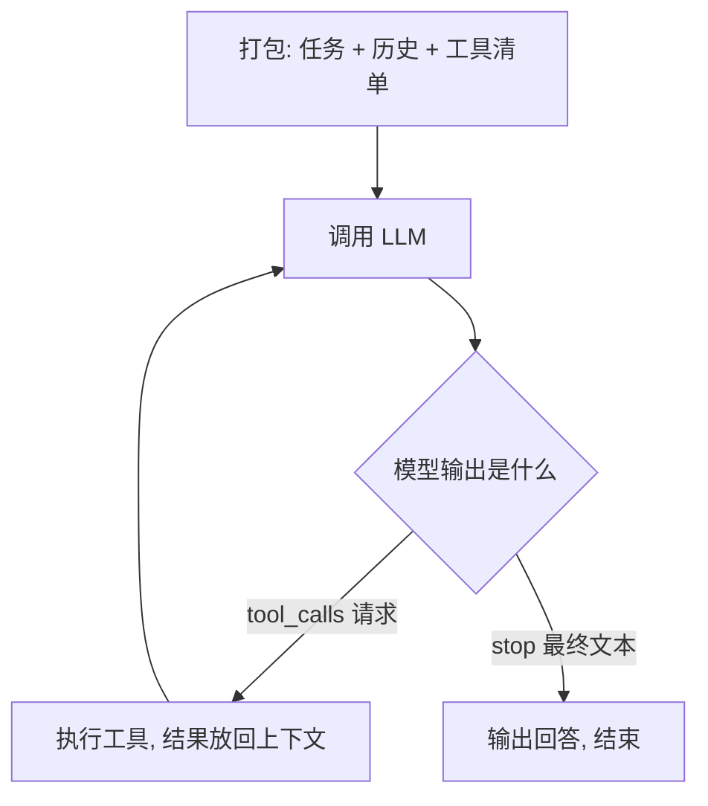

# 第 1 篇 · 理论框架：Agent 与 Harness

> **搭建路线**：从零搭 Agent 系列的第 0 块积木——先看懂图纸，再动手拼装。
> **本篇目标**：搞清三件事——LLM 的三条物理定律、Agent 的定义、以及 Harness 如何让"循环"变成"系统"。代码只保留最能说明原理的核心片段，重点是**为什么**。
> **难度**：⭐⭐

---

## 1. LLM 的三条物理定律

动手搭 Agent 之前，先记住模型的三条"物理定律"——它们决定了后面所有工程决策。

### 定律一：模型按 token 思考

LLM 的输入输出单位不是字符，而是 **token**——文本被分词器切成的小块。主流模型使用 **BPE（字节对编码）**：从单字符开始，反复把"出现频率最高的相邻字符对"合并成一个新符号，直到达到预设词表大小。

```text
原始文本: h e l l o   w o r l d
合并高频对 → [hello] [ world]    ← 常见词/子词成为一个 token
```

三个直接后果，每一个都影响你的工程决策：

1. **计费按 token**：输入+输出 token 数 × 单价 = 成本（第 9 篇的成本控制全靠它）；
2. **上下文上限是 token 数**：128K 上下文 ≈ 8~10 万汉字，不是字符数；
3. **KV 缓存按 token 复用**：前缀 token 序列不变才能命中缓存（见定律三）。

> 中文大约 1~2 个汉字 = 1 个 token；代码的缩进、常见关键字是高频对，会形成专用 token——这解释了为什么代码类 token 密度高、模型擅长代码。

### 定律二：模型按概率采样，不查字典

LLM 的核心是一个条件概率分布：给定前面所有 token，预测下一个 token 的概率。**关键认知：这不是检索，是采样**——模型输出的每个字都是从分布中抽出来的：

```text
P(next | "今天天气") → { "真": 0.4, "很": 0.3, "不错": 0.2, ... }
采样 → "很"
P(next | "今天天气很") → { "好": 0.5, ... } → "好"
输出："今天天气很好"
```

两个参数决定了这个分布的"形状"：

| 参数 | 作用 | 直觉 |
|---|---|---|
| `temperature` | 分布尖锐度（0~1） | 越低越"只选最可能"，越高越"敢于冒险" |
| `top_p` | 只从累积概率 top_p 的 token 里采样 | 砍掉长尾低概率 token，防止"胡说" |

> **为什么这决定工程行为**：写代码用低 temperature（0~0.3，确定性优先）；评测必须固定 temperature=0（可复现，第 9 篇评测的硬要求）。**"模型会随机"不是 bug，是机制**——这也是为什么 Agent 需要重试、反思和评测。

### 定律三：注意力有限，前缀可缓存

上下文窗口为什么存在？因为模型内部是**注意力机制**：每个 token 要与前面所有 token 计算相关性，上下文越长，计算量越大、信息越被"稀释"。

> **手电筒类比**：注意力像手电筒在黑暗房间里找东西——房间越大，光束越分散，每件物品被照到的注意力越弱。模型"记不住"早期内容不是忘了，是**注意力被摊薄了**。这是物理限制，不是工程偷懒。

**KV 缓存**是推理引擎的优化：生成时每个 token 的注意力中间状态（Key/Value）被缓存，**只要请求前缀的 token 序列不变，前缀状态直接复用**：

```text
请求 A: [system][工具描述][历史] [新问题]   ← 前缀被缓存
请求 B: [system][工具描述][历史] [新问题']  ← 前缀相同 → 命中缓存（省钱省时）
请求 C: [system][工具描述改一个字][历史]... ← 前缀变了 → 缓存全部失效
```

> **备菜类比**：请求 A 时把"system + 工具描述 + 历史"全部切好洗净（算好 Key/Value）；请求 B 只是加了句新问题，直接下锅（复用缓存）；改动前缀任何一个字 = 倒掉重切。**生产框架把提示词前缀当作"神圣不可侵犯"的区域**——工具描述顺序固定、文本确定、历史只追加不修改。

### 1.4 一次真实的 API 调用

用 OpenAI SDK 调 DeepSeek 模型（协议兼容）：

```python
# pip install openai
from openai import OpenAI
client = OpenAI(api_key="sk-...", base_url="https://api.deepseek.com")

resp = client.chat.completions.create(
    model="deepseek-chat",
    messages=[{"role": "user", "content": "1 + 1 = ?"}],
    temperature=0.2,
)
print(resp.choices[0].message.content)   # 答案
print(resp.usage)                        # token 统计（计费依据）
```

注意响应里的 `finish_reason` 字段——它只有几个取值（`stop` / `length` / `tool_calls` / `content_filter`），**它就是 Agent 循环的"信号灯"**：模型决定调用工具时，这个字段会变成 `tool_calls`。

> **练习 1.1**：跑通上面代码，打印完整响应 JSON。观察 `finish_reason` 与 `usage` 两个字段。

## 2. Agent 的定义：目标导向的自主系统

> **Agent = LLM（大脑）+ 工具（手脚）+ 循环（编排）**

拆开看三个词的含义：

- **大脑**：LLM 负责理解、推理、决策——但它**只会输出文本**；
- **手脚**：工具是你注册给模型的可调用函数——执行代码、读写文件、搜索网页；
- **编排**：循环代码把两者串起来——这是 99% 的"智能"实际发生的地方，也是你（开发者）唯一完全掌控的部分。

Agent 与单次问答的 LLM 调用的本质区别：**目标导向（Goal-Oriented）**——反复感知环境、做出决策、执行动作，直到目标达成或任务终止。最小循环只有三步：**感知（Observe）→ 思考（Think）→ 行动（Act）**。

**最重要的心智模型**：模型本身不执行任何东西。它只输出两种东西之一——普通文本（`finish_reason: stop`，最终回答）或工具调用请求（`finish_reason: tool_calls`）。执行永远发生在你的代码里。



> **一个真实回合的 trace**（"把 123 和 456 相加再乘 2"）：第 1 次请求 → 模型要 `add(123,456)` → 你执行得 579 → 回填 → 第 2 次请求 → 模型要 `multiply(579,2)` → 回填 → 第 3 次请求 → 输出 1158。**三次完整往返**——这就是为什么多步任务慢，也是第 8 篇 PTC 模式存在的理由。

## 3. 函数调用：Agent 的交互单元

### 3.1 本质：工具调用也是"文本生成"

先建立一个反直觉但关键的认知：**模型请求调用工具，本质上仍然是生成了一段文本**——只是这段文本恰好符合我们定义的 JSON 格式。模型看到工具描述（一段文本），基于任务生成"我想调 get_weather，参数是 {city: 北京}"（一段 JSON 文本）。**模型没有执行任何东西，也感知不到工具的"真实"存在**。

这个认知解释了两个现象：
- **模型会"幻觉"参数**（编造不存在的城市名）——因为它只是按概率续写文本；
- **工具描述的质量直接决定调用质量**——描述是模型对工具唯一的认知来源。

### 3.2 三阶段机制（完整示例）

**阶段一：告诉模型"你有什么工具"**——每个工具是一个 JSON Schema 描述（模型看到的是这段文本）：

```python
tools = [{
    "type": "function",
    "function": {
        "name": "get_weather",
        "description": "查询指定城市的当前天气",   # ← 模型靠它做决策
        "parameters": {
            "type": "object",
            "properties": {"city": {"type": "string"}},
            "required": ["city"],
            "additionalProperties": False,          # 防止发明字段
        },
    },
}]
```

**阶段二：模型返回调用请求**——注意 `finish_reason: "tool_calls"` 与 `arguments` 是 **JSON 字符串**（必须 parse 才能用）：

```json
{
  "choices": [{
    "finish_reason": "tool_calls",
    "message": {
      "role": "assistant", "content": null,
      "tool_calls": [{
        "id": "call_abc123",                    // ← 回填时要对应
        "function": { "name": "get_weather",
                      "arguments": "{\"city\": \"北京\"}" }
      }]
    }
  }]
}
```

**阶段三：你执行，结果回填**——结果作为 `role: "tool"` 消息、携带 `tool_call_id` 追加回消息数组，再次请求：

```python
messages.append({"role": "tool", "tool_call_id": "call_abc123", "content": "{\"temp\": 25}"})
resp = client.chat.completions.create(model=..., messages=messages, tools=tools)
```

> **练习 1.2**：给模型 `add` 和 `multiply` 两个工具，问"计算 (2+3)*4"。观察需要几轮——这就是多步工具调用，是所有 Agent 的雏形。

### 3.3 工程要点（踩坑总结）

1. **arguments 是字符串**：必须 `json.loads` 解析，且要处理解析失败（模型可能给非法 JSON）；
2. **一次响应可能多个 tool_calls**：循环要支持并行执行——**只读调用可并发，写操作串行**（生产框架的调度契约，第 8 篇 PTC 的实现）；
3. **失败的正道是"把错误回填给模型"**：把异常转成 `isError: true` 的 tool 消息回填，让模型读到失败并自我修正——失败不进上下文，模型就没有纠正机会；
4. **工具数量控制**：一个 Agent 可见工具建议 ≤ 20 个，多了模型"选择困难"甚至忽略工具直接瞎答；
5. **描述第一句要点题**：`"查询指定城市的当前天气，当用户问天气时使用"` 优于 `"天气工具"`。


## 4. 模块全景：从"循环"到"系统"的 9 块积木

一个最小循环能跑起来，但离"系统"还差 9 块积木（Tritium《Build An Agent From Scratch》[1] 的模块全景，CC BY-NC-SA）：

| 模块 | 职责 | 没有它怎样 | 层次 |
|---|---|---|---|
| Agent Loop | 驱动感知→思考→行动循环 | 系统无法运转 | 核心 |
| LLM Client | 封装模型 API：流式/重试/超时 | 无法与模型通信 | 核心 |
| Tool System | 定义/注册/调用工具，解析调用请求 | Agent 只能输出文字 | 核心 |
| 上下文管理器 | 组织每轮 Prompt、管理 Token 预算 | 模型看到的信息混乱 | **Harness** |
| 记忆系统 | 短期/中期/长期分层存储，按需调入 | 无法跨轮次连贯，长任务必败 | **Harness** |
| 规划模块 | 目标分解为子任务，维护任务树与进度 | 只能处理单步任务 | **Harness** |
| 反思模块 | 监控结果、检测失败、死循环时介入 | 在错误中反复打转 | **Harness** |
| 缓存管理器 | 维护前缀稳定，最大化 KV Cache 命中 | 每次全量计费，成本失控 | 成本 |
| 安全与可观测 | 拦截危险操作、记录每轮输入输出 | 可能破坏系统且无从排查 | 治理 |

**模块添加顺序就是 Agent 工程的成长路径**，也是本系列后续每一篇的顺序：先有能跑的最小系统，再一块一块拼上 Harness 模块。第 8 篇你会看到 DSH 的预设就是这些模块的插件化组装——同样的 9 块积木，生产级的拼法。

## 5. Harness：让系统协调运转的"挽具"

### 5.1 马具类比

在模型（马）与工具（车）之间，还需要一套让整个系统协调运转的装置——**Harness（挽具）**。它的本质是**上下文工程（Context Engineering）与注意力管理（Attention Management）系统**，解决一个核心矛盾：

> Agent 运行中产生的**无限信息空间**，与 LLM **有限且易受干扰的上下文窗口**之间的矛盾。

Harness 通过控制输入模型的信息内容、格式、位置和密度，引导模型把有限的注意力集中在当前最关键的决策上，避免目标漂移（Goal Drifting）、幻觉和"中间迷失"（Lost in the middle）。

### 5.2 四种日常机制

1. **信息过滤与截断**：模型不需要也不应该看到所有执行细节——决定什么进 Prompt、什么被丢弃（超长报错日志截断或总结后喂给模型，防止挤占注意力）；
2. **格式化与认知减负（Cognitive Offloading）**：把工具返回的杂乱数据转化为清晰的 Markdown/JSON/XML——降低"解析负担"，让模型把注意力留给"推理"而非"解析"；
3. **状态锚定与目标重申（State Anchoring）**：长链路任务中模型极易忘记最初目标——每轮强制注入系统提示词、任务状态或进度总结，把注意力拉回主线；
4. **记忆的分层调度（Memory Scheduling）**：短期（当前轮次）/中期（任务计划与草稿）/长期（知识库与偏好），按需动态调入调出。

### 5.3 五个设计维度

| 维度 | 核心目标 | 常见手段 |
|---|---|---|
| 上下文（Context） | 优化注意力分配，对抗长文本遗忘 | 滑动窗口截断、动态摘要压缩、XML 结构化隔离 |
| 工具与动作（Action） | 规范输出边界，降低试错成本 | JSON Schema 强类型、自动重试、错误堆栈精简 |
| 状态与规划（State） | 维持长期连贯性，防止目标漂移 | Plan-and-Solve、任务树管理 |
| 反思与纠错（Reflection） | 自我监督，打破死循环 | 失败阈值拦截（连续失败 3 次求助）、Critic 机制 |
| 成本与缓存（Cache） | 最大化缓存命中率 | 前缀稳定性设计、历史只追加不重写 |

## 6. 缓存友好分层：成本维度的核心约束

主流 LLM API 的 Prompt Cache 对前缀完全一致的部分按 10%~25% 计价。缓存命中的核心条件是**前缀 byte 级精确匹配**，因此上下文必须按"变化频率单调递增"分层：

| 内容类型 | 变化频率 | 位置 |
|---|---|---|
| System Prompt（角色/工具列表/全局规则） | 极低 | 最前，**冻结**（任务周期内禁止修改） |
| 长期记忆/知识库片段 | 低 | 之后（加载后不得重排） |
| 任务计划/当前 Plan | 中 | 中间（只追加新状态，不重写历史） |
| 历史对话/工具记录 | 高 | 靠后（严格只追加） |
| 当前轮次 User Message | 每轮必变 | 最末尾（缓存边界之外） |

**两条关键推论**：工具列表**全量固定**（工具定义体积大，任何变动使其后所有缓存失效）；历史记录**只追加不重写**（哪怕是微小格式调整）。

## 7. Harness 五条设计原则

1. **最小信息原则**：只提供当前步骤绝对需要的信息和工具——信息越多，注意力越分散；
2. **显式结构化隔离**：用清晰标记（如 <thought>、<observation>、<plan>）隔离不同类型信息，帮模型区分系统指令与外部反馈；
3. **动态注意力预算**：把上下文窗口视为预算，用动态打分决定每条信息在 Prompt 中的去留；
4. **失败是第一等公民**：工具失败时把错误包装成"引导性反馈"，主动引导模型注意力去解决问题，而非只返回报错；
5. **缓存友好分层**：上下文变化频率从前到后单调递增，System Prompt 冻结，历史只追加。

> **统一视角**：注意力管理与缓存友好看似出发点不同，实则指向同一结论——上下文必须严格分层，且层间变化频率单调递增。既让模型以最低认知负荷找到关键指令，又让稳定前缀持续命中缓存。

## 8. 检验：读完本篇，你能回答吗

1. LLM 的三条"物理定律"是什么？每条对工程决策的影响是什么？
2. temperature 与 top_p 各控制什么？为什么评测必须固定 temperature=0？
3. 为什么"函数调用本质是文本生成"？这解释了哪个工程现象（幻觉参数）？
4. 9 块积木中哪 4 块属于 Harness 层？添加顺序为什么重要？
5. 马具类比说明 Harness 的本质是什么？四种日常机制是哪四种？
6. 缓存友好的上下文分层原则是什么？两条推论是什么？
7. 工具失败的正确处理方式是什么？为什么比代码里硬重试更有效？

（答案都在上文：1-2→§1，3→§3.1，4→§4，5→§5，6→§6，7→§3.3）

## 本章小结

本篇是整套课程的**图纸**：你知道了模型的物理定律、Agent 的定义、9 块积木的全景，以及 Harness 如何用"上下文工程 + 注意力管理"把循环变成系统。接下来的每一篇，都是在这张图纸上拼一块真实的积木。

**下一篇**：[第 2 篇 · 最小 Agent Loop](02-最小AgentLoop.md) —— 拼上第一块能跑的积木：35 行循环让模型会思考、工具能执行、结果能回填。
