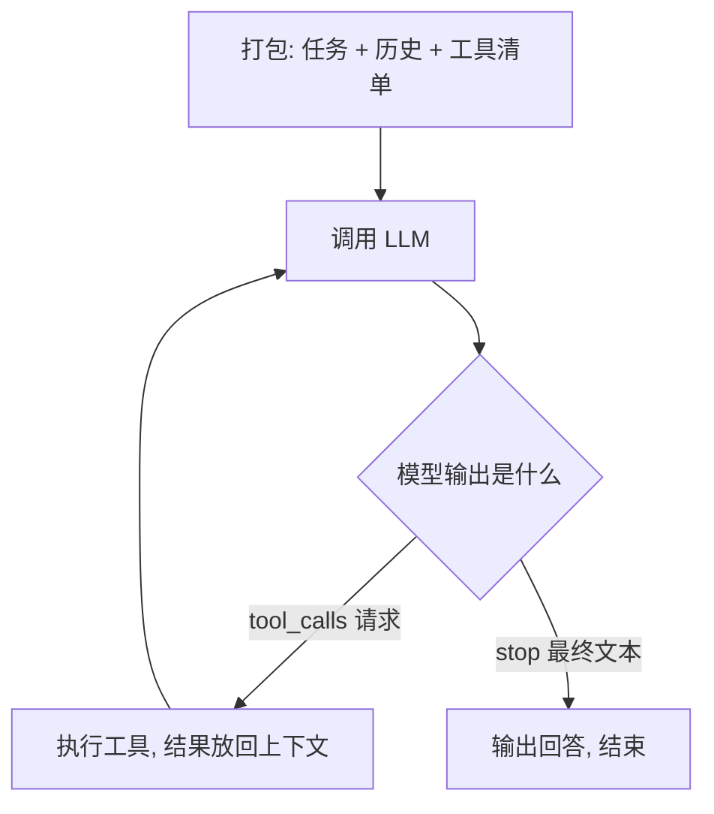

# 第 1 篇 · 理论框架：Agent 与 Harness

> **搭建路线**：从零搭 Agent 系列的第 0 块积木——先看懂图纸，再动手拼装。
> **本篇目标**：搞清三件事——LLM 的物理定律、Agent 的定义、以及 Harness 如何让"循环"变成"系统"。
> **难度**：⭐⭐
> **系列主线**（后续每篇拼上一块）：理论框架 → 最小 Agent Loop → 工具系统 → 上下文引擎 → 记忆 → Planning → MCP/Skills → DSH 生产级参照 → 企业实战 → 前沿路线。

---

## 1. LLM 的三条物理定律

动手搭 Agent 之前，先记住模型的三条"物理定律"——它们决定了后面所有工程决策。

### 定律一：模型按 token 思考

LLM 的输入输出单位是 **token**（BPE 分词：反复合并高频字符对）。三个直接后果：计费按 token、上下文上限按 token（128K ≈ 8~10 万汉字）、缓存按 token 复用。

### 定律二：模型按概率采样，不查字典

```text
P(next | "今天天气") → { "真": 0.4, "很": 0.3, "不错": 0.2, ... } → 采样 → "很"
```

`temperature` 决定分布尖锐度（写代码 0~0.3，评测固定 0 保证可复现）；`top_p` 砍掉低概率长尾。"模型会随机"不是 bug 是机制——这是 Agent 需要重试、反思和评测的根本原因。

### 定律三：注意力有限，前缀可缓存

上下文窗口存在是因为**注意力机制**：每个 token 要与前面所有 token 计算相关性，内容越多注意力越被摊薄。

> **手电筒类比**：注意力像手电筒在黑暗房间找东西——房间越大，光束越分散。模型"记不住"早期内容不是忘了，是注意力被摊薄了。

**KV 缓存**：生成时每个 token 的注意力中间状态被缓存，**前缀 token 序列不变即可复用**（价格降至 10%~25%）。

> **备菜类比**：请求 A 时把前缀切好洗净，请求 B 直接下锅；改动前缀任何一字 = 倒掉重切。生产框架把提示词前缀当作"神圣不可侵犯"的区域。

## 2. Agent 的定义：目标导向的自主系统

> **Agent = LLM（大脑）+ 工具（手脚）+ 循环（编排）**

Agent 与单次问答的 LLM 调用的本质区别：**目标导向（Goal-Oriented）**——反复感知环境、做出决策、执行动作，直到目标达成或任务终止。

最小循环只有三步：**感知（Observe）→ 思考（Think）→ 行动（Act）**。每一轮，Agent 接收观测（工具返回值、用户消息、错误），交给模型推理，输出下一步动作；动作结果成为下一轮观测。

**最重要的心智模型**：模型本身不执行任何东西——它只输出两种东西之一：普通文本（`finish_reason: stop`，最终回答）或工具调用请求（`finish_reason: tool_calls`）。执行永远发生在你的代码里。



## 3. 函数调用：Agent 的交互单元

函数调用是 Agent 技术的**地基**。三阶段：**schema 描述 → tool_calls 请求 → 执行回填**。

**反直觉的认知**：模型请求调用工具，本质上仍是生成了一段文本——恰好符合我们定义的 JSON 格式。模型看到工具描述（文本），基于任务生成调用请求（JSON 文本）。**模型没有执行任何东西，也感知不到工具的"真实"存在**。

这个认知解释了两个现象：模型会"幻觉"参数（只是按概率续写）；工具描述的质量直接决定调用质量（描述是模型对工具唯一的认知来源）。

```text
你的代码 ──(1) tools 描述──▶ 模型 ──(2) tool_calls 请求──▶ 你的代码
   ▲                                                          │
   └────────────(3) tool 结果回填，再来一轮────────────────────┘
```

> 工程要点预告（第 2、3 篇展开）：arguments 是 JSON 字符串必须解析；一次响应可多个 tool_calls；失败的正道是"把错误回填给模型让它纠正"；工具数量 ≤ 20 个。


## 4. 模块全景：从"循环"到"系统"的 9 块积木

一个最小循环能跑起来，但离"系统"还差 9 块积木（Tritium《Build An Agent From Scratch》[1] 的模块全景，CC BY-NC-SA）：

| 模块 | 职责 | 没有它怎样 | 层次 |
|---|---|---|---|
| Agent Loop | 驱动感知→思考→行动循环 | 系统无法运转 | 核心 |
| LLM Client | 封装模型 API：流式/重试/超时 | 无法与模型通信 | 核心 |
| Tool System | 定义/注册/调用工具，解析调用请求 | Agent 只能输出文字 | 核心 |
| 上下文管理器 | 组织每轮 Prompt、管理 Token 预算 | 模型看到的信息混乱 | **Harness** |
| 记忆系统 | 短期/中期/长期分层存储，按需调入 | 无法跨轮次连贯，长任务必败 | **Harness** |
| 规划模块 | 目标分解为子任务，维护任务树与进度 | 只能处理单步任务 | **Harness** |
| 反思模块 | 监控结果、检测失败、死循环时介入 | 在错误中反复打转 | **Harness** |
| 缓存管理器 | 维护前缀稳定，最大化 KV Cache 命中 | 每次全量计费，成本失控 | 成本 |
| 安全与可观测 | 拦截危险操作、记录每轮输入输出 | 可能破坏系统且无从排查 | 治理 |

**模块添加顺序就是 Agent 工程的成长路径**，也是本系列后续每一篇的顺序：先有能跑的最小系统，再一块一块拼上 Harness 模块。第 8 篇你会看到 DSH 的预设就是这些模块的插件化组装——同样的 9 块积木，生产级的拼法。

## 5. Harness：让系统协调运转的"挽具"

### 5.1 马具类比

在模型（马）与工具（车）之间，还需要一套让整个系统协调运转的装置——**Harness（挽具）**。它的本质是**上下文工程（Context Engineering）与注意力管理（Attention Management）系统**，解决一个核心矛盾：

> Agent 运行中产生的**无限信息空间**，与 LLM **有限且易受干扰的上下文窗口**之间的矛盾。

Harness 通过控制输入模型的信息内容、格式、位置和密度，引导模型把有限的注意力集中在当前最关键的决策上，避免目标漂移（Goal Drifting）、幻觉和"中间迷失"（Lost in the middle）。

### 5.2 四种日常机制

1. **信息过滤与截断**：模型不需要也不应该看到所有执行细节——决定什么进 Prompt、什么被丢弃（超长报错日志截断或总结后喂给模型，防止挤占注意力）；
2. **格式化与认知减负（Cognitive Offloading）**：把工具返回的杂乱数据转化为清晰的 Markdown/JSON/XML——降低"解析负担"，让模型把注意力留给"推理"而非"解析"；
3. **状态锚定与目标重申（State Anchoring）**：长链路任务中模型极易忘记最初目标——每轮强制注入系统提示词、任务状态或进度总结，把注意力拉回主线；
4. **记忆的分层调度（Memory Scheduling）**：短期（当前轮次）/中期（任务计划与草稿）/长期（知识库与偏好），按需动态调入调出。

### 5.3 五个设计维度

| 维度 | 核心目标 | 常见手段 |
|---|---|---|
| 上下文（Context） | 优化注意力分配，对抗长文本遗忘 | 滑动窗口截断、动态摘要压缩、XML 结构化隔离 |
| 工具与动作（Action） | 规范输出边界，降低试错成本 | JSON Schema 强类型、自动重试、错误堆栈精简 |
| 状态与规划（State） | 维持长期连贯性，防止目标漂移 | Plan-and-Solve、任务树管理 |
| 反思与纠错（Reflection） | 自我监督，打破死循环 | 失败阈值拦截（连续失败 3 次求助）、Critic 机制 |
| 成本与缓存（Cache） | 最大化缓存命中率 | 前缀稳定性设计、历史只追加不重写 |

## 6. 缓存友好分层：成本维度的核心约束

主流 LLM API 的 Prompt Cache 对前缀完全一致的部分按 10%~25% 计价。缓存命中的核心条件是**前缀 byte 级精确匹配**，因此上下文必须按"变化频率单调递增"分层：

| 内容类型 | 变化频率 | 位置 |
|---|---|---|
| System Prompt（角色/工具列表/全局规则） | 极低 | 最前，**冻结**（任务周期内禁止修改） |
| 长期记忆/知识库片段 | 低 | 之后（加载后不得重排） |
| 任务计划/当前 Plan | 中 | 中间（只追加新状态，不重写历史） |
| 历史对话/工具记录 | 高 | 靠后（严格只追加） |
| 当前轮次 User Message | 每轮必变 | 最末尾（缓存边界之外） |

**两条关键推论**：工具列表**全量固定**（工具定义体积大，任何变动使其后所有缓存失效）；历史记录**只追加不重写**（哪怕是微小格式调整）。

## 7. Harness 五条设计原则

1. **最小信息原则**：只提供当前步骤绝对需要的信息和工具——信息越多，注意力越分散；
2. **显式结构化隔离**：用清晰标记（如 <thought>、<observation>、<plan>）隔离不同类型信息，帮模型区分系统指令与外部反馈；
3. **动态注意力预算**：把上下文窗口视为预算，用动态打分决定每条信息在 Prompt 中的去留；
4. **失败是第一等公民**：工具失败时把错误包装成"引导性反馈"，主动引导模型注意力去解决问题，而非只返回报错；
5. **缓存友好分层**：上下文变化频率从前到后单调递增，System Prompt 冻结，历史只追加。

> **统一视角**：注意力管理与缓存友好看似出发点不同，实则指向同一结论——上下文必须严格分层，且层间变化频率单调递增。既让模型以最低认知负荷找到关键指令，又让稳定前缀持续命中缓存。

## 8. 检验：读完本篇，你能回答吗

1. LLM 的三条"物理定律"是什么？每条对工程决策的影响是什么？
2. Agent 与单次问答的本质区别？模型实际"执行"工具吗？
3. 为什么说"函数调用本质是文本生成"？这解释了哪个工程现象？
4. 9 块积木中哪 4 块属于 Harness 层？添加顺序为什么重要？
5. 马具类比说明 Harness 的本质是什么？四种日常机制是哪四种？
6. 缓存友好的上下文分层原则是什么？两条推论是什么？

（答案都在上文：1→§1，2→§2，3→§3，4→§4，5→§5，6→§6）

## 本章小结

本篇是整套课程的**图纸**：你知道了模型的物理定律、Agent 的定义、9 块积木的全景，以及 Harness 如何用"上下文工程 + 注意力管理"把循环变成系统。接下来的每一篇，都是在这张图纸上拼一块真实的积木。

**下一篇**：[第 2 篇 · 最小 Agent Loop](02-最小AgentLoop.md) —— 拼上第一块能跑的积木：35 行循环让模型会思考、工具能执行、结果能回填。
