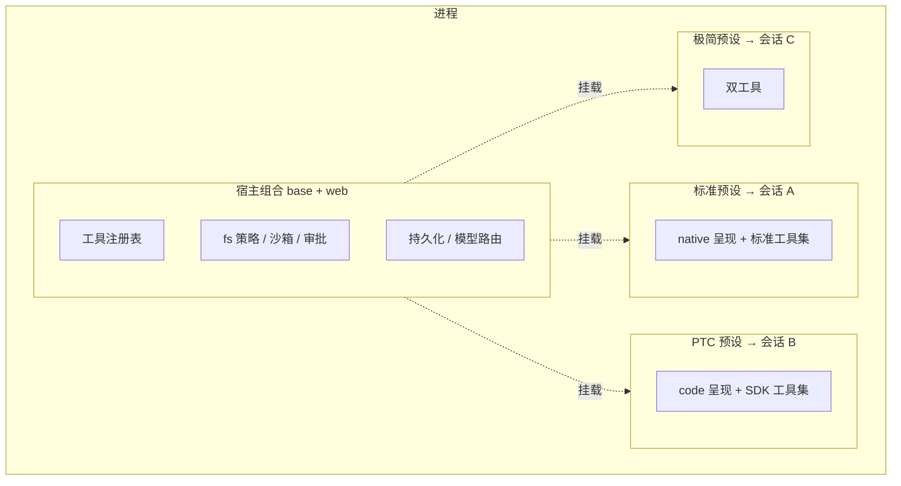
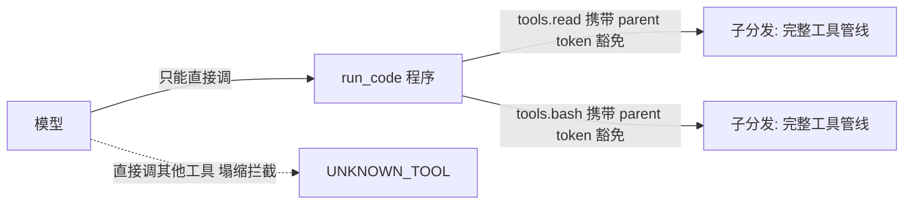
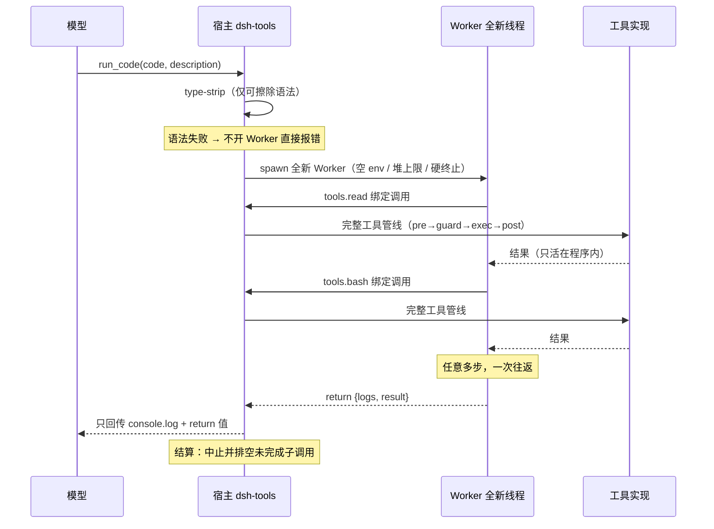

# 第 3 篇 · DSH 深度解剖（深度版）

> **难度**：⭐⭐⭐
> **本篇目标**：深入 DSH 内部——启动体系、Cordis 插件系统、双平面架构、四个预设（含真实配置对比）、PTC 机制链（含真实源码引用）、安全、记忆、高级能力，并给出**动手实验清单**和源码地图。读完你能"读懂"一个生产级 Agent 框架，并具备第 4 篇动手的基础。
> **版本**：DSH 0.1.0-rc.6（`@deepseek-ai/dsh@0.1.0-rc.6`）。文中所有源码引用基于本机 npx 安装产物，行号为编译产物行号。

---

## 1. 宏观：DSH 是怎么启动的

### 1.1 三种入口

```bash
dsh web                          # 启动 Web UI（--profile web 的别名）
dsh --profile headless "job"     # 无头模式：跑一个任务，打印答案退出（CI 集成用它）
dsh plugin --profile <name> <pnpm args>   # 管理某个 profile 的插件（安装/移除）
```

参数规则：启动器 flag 必须写最前面，之后第一个无法识别的 token 标志着应用参数开始：

```bash
dsh --profile web --port 8080    # --port 属于 web 应用，不是启动器
dsh --profile headless "run the tests"   # 引号内是任务
dsh --help                       # 启动器自己的帮助
```

### 1.2 Profile：配置档案

一个 profile = 一个目录（默认 `$DSH_HOME/profiles/<name>`，`DSH_HOME` 默认 `~/.dsh`），包含：

```text
profiles/<name>/
├── package.json          # 树外插件依赖
├── dsh.profile           # profile 元数据：bundles 列表（按序组合）
└── cordis.patch.yml      # 用户自己的插件配置覆盖层
```

`dsh.profile` 的 `bundles` 声明"这个 profile 由哪些组合包叠成"：

```yaml
# dsh.profile（示意）
bundles:
  - "@deepseek-ai/dsh-base"        # 基础宿主组合
  - "@deepseek-ai/dsh-web-app"     # Web 应用组合
  # 自定义组合包可以加在这里（第 4 篇实战）
```

### 1.3 配置树：五层叠加

配置按顺序叠加，后层覆盖前层（`--dump-config` 可查看合并结果）：

```text
1. 空根
2. dsh.profile.bundles 中每个组合包的 patch（base → web-app → headless…）
3. profile 自己的 cordis.patch.yml
4. $DSH_HOME/cordis.patch.yml（用户全局覆盖）
5. 命令行 --patch 指定的覆盖层（调试/临时）
```

> **核心认知**：DSH 的"配置"不是键值对，而是一段 **Cordis 插件组合（composition）**。你加功能 = 往组合里加插件行；改行为 = 加 patch 层覆盖。一切皆插件不是口号，是字面意义。

## 2. 地基：Cordis 插件系统

Cordis（DSH 依赖 `cordis@4.x`，npm 上另有 `@deepseek-ai/cordis` 发行）是专为"需要显式依赖注入、作用域服务、生命周期托管清理、配置驱动加载"的应用设计的 TypeScript 插件框架。

### 2.1 五个核心概念（对照官方示例）

Cordis 官方 README 的最小示例（完整可跑）：

```ts
import { Context, Service } from 'cordis'

declare module 'cordis' {
  interface Context { counter: Counter }
  interface Events { 'app/ready'(message: string): void }
}

class Counter extends Service {
  value = 0
  constructor(ctx: Context) { super(ctx, 'counter') }
  next() { return ++this.value }
}

const greeter = Object.assign((ctx: Context) => {
  ctx.on('app/ready', (message) => {
    ctx.logger.info('%s #%d', message, ctx.counter.next())
  })
}, { inject: ['counter'] })   // ★ 声明依赖

const root = new Context()
await root.plugin(Counter)    // ★ 启动插件
await root.plugin(greeter)
root.emit('app/ready', 'started')
await root.fiber.dispose()    // ★ 销毁：所有副作用自动清理
```

五个概念的精确含义：

| 概念 | 含义 | 生命周期 |
|---|---|---|
| `Context` | 依赖容器根，是插件们共享的"总线" | 进程/会话级 |
| `ctx.plugin()` | 装载一个插件，返回 `Fiber` | 立即启动 |
| `Fiber` | 插件实例的生命周期单元 | dispose 时清理一切 |
| `inject` | 声明依赖（`counter` 必须已存在） | 装载前解析 |
| `Service` | 可注入的具名服务（如 `ctx.tools`） | 随 Fiber 卸载 |

### 2.2 为什么 Fiber 生命周期托管是"最值钱的设计"

普通插件系统的噩梦：插件 A 注册了事件监听、定时器、服务，插件 B 要卸载 A——你永远不知道 A 注册了什么，只能手动清理，漏一个就内存泄漏/事件泄漏。

Cordis 的做法：**插件注册的所有副作用都挂在它自己的 Fiber 上**，`fiber.dispose()` 一次性回收。DSH 的"创造模式"能安全地动态定义、启动、停止插件，全靠这个机制——动态插件卸载后，它注册的工具、事件、服务全部消失，不留残渣。

### 2.3 Realm（领域）与 isolate：作用域隔离的关键字

Cordis 的 `realm` 概念是 DSH 双平面架构的基石：

```yaml
- id: planning
  name: cordis:group        # 分组
  group: true
  isolate:                  # ★ 隔离领域声明
    planMode: true          # 该分组内的服务只在"本预设"内可见
  config:
    - id: plan-mode
      name: '@deepseek-ai/dsh-plan-mode'
```

- **根领域（root realm）**：进程全局，宿主组合的东西在这里（注册表、沙箱）；
- **隔离领域（isolated realm）**：每个预设私有，多会话挂载同一预设时互不冲突。

> 官方注释（`standard/agent.cordis.yml` 原文）解释了为什么预设里的服务必须隔离：
> "A service row here MUST sit inside a group carrying an `isolate` realm. Without one it publishes into the root realm, where it is process-global — another preset publishing the same name collides…"（预设里的服务行必须放在带 isolate 领域的分组里，否则泄漏为进程级，别的预设同名注册就会冲突。）

## 3. 双平面架构：宿主组合 vs 会话预设

DSH 把插件行分成两个平面——**这是理解整个项目的第一把钥匙**。

### 3.1 两张清单

| 归属 | 文件 | 内容 | 判据 |
|---|---|---|---|
| **宿主组合** | `base.cordis.yml` + `web.cordis.yml` | 工具注册表本身、文件系统服务与策略、沙箱与审批栈、持久化、模型路由、子代理注册表、token 计量、浏览器全局事件 | **跨会话共享的东西**；注入发生在会话存在之前的东西 |
| **Agent 预设** | `config/agent-presets/*/agent.cordis.yml` | 该会话的工具行、persona、提示词段、能力开关 | **只属于一个会话的东西**；工具与提示词 |

### 3.2 为什么不能混在一起

**餐厅类比**：宿主组合是**厨房**（煤气、水、电、锅碗——所有桌子共享的设施），预设是**菜单**（每桌客人点的菜不同）。厨房不能因为某桌客人换了菜单就重装燃气管道；菜单也不能自己决定“不用厨房的锅”。注册表、沙箱、审批是“厨房设施”，工具、提示词是“菜单内容”——**设施全局唯一，菜单按桌定制**，这就是双平面。


一个进程要同时跑"标准模式会话"和"PTC 模式会话"，它们工具集不同（PTC 的模型只见 `run_code`），但**注册表必须只有一个**（否则两个会话的工具互相污染）。所以：

- 注册表、沙箱、审批 → 宿主（平台，全局唯一）；
- 工具行、提示词 → 预设（租户，每会话不同）。



> 一个预设同时被多个会话命名时，通过 scope parentage（作用域父子关系）共享工具行，但每个会话的状态（对话历史、token 计量）按 Session/Agent 独立键控。

## 4. 四个内置预设（读真实配置学架构）

预设目录：`config/agent-presets/`。**读预设 = 读 Agent 的"能力面"**。四个预设的配置差异本身就是最好的架构教材。

### 4.1 预设的"骨架"长什么样（标准模式）

（注：下面的 {{model}}/{{cwd}} 是 DSH 模板变量，此处用 raw 标签保护，避免被 Jekyll 当 Liquid 求值）

```yaml
# standard/agent.cordis.yml（节选，真实内容）
- id: persona                    # 人设：一句话定义这个 Agent 是谁
  name: '@deepseek-ai/dsh-persona'
  config:
    text: >-
      You are a coding agent powered by the {{model}} model. Your working directory is {{cwd}}.
      # {{model}} 和 {{cwd}} 从 Agent 自己的路由与工作区解析

- id: tool-bash                  # shell 工具（Win 上禁用）
  name: '@deepseek-ai/dsh-tool-bash'
  disabled: !!js process.platform === 'win32'

- id: tool-fs                    # 文件工具（注册进宿主的 tools 注册表）
  name: '@deepseek-ai/dsh-tool-fs'

- id: planning                   # 计划模式（隔离领域）
  name: cordis:group
  group: true
  isolate: { planMode: true }
  config:
    - id: plan-mode
      name: '@deepseek-ai/dsh-plan-mode'

# 标准模式不声明呈现模式——native 是默认值。
# （只有 code 预设才新增 tool-presentation 并设 mode: code，见 4.3）
```


### 4.2 极简模式：把"预设"压缩到极致

`minimal` 预设只有两个工具（持久 bash + str_replace_editor），persona 就是完整系统提示词，**连压缩都没有**。真实配置揭示了几个技巧：

```yaml
# minimal/agent.cordis.yml（节选，真实内容）
- id: persona
  name: '@deepseek-ai/dsh-persona'
  config:
    text: You are a helpful software engineer assistant.
    complete: true                 # ★ 完整提示词：别人不能再加
    includeRuntimeContext: false   # ★ 不带运行时上下文快照

- id: persistent-shell             # PTY 注册表是 agent 私有服务 → 必须隔离
  name: cordis:group
  group: true
  isolate: { terminals: true }
  config:
    - id: persistent-bash
      name: '@deepseek-ai/dsh-tool-bash-persistent'
      config:
        timeoutMs: 300000
        description: |-
          Run commands in a bash shell
          * State is persistent across command calls and discussions with the user.
          * Please avoid commands that may produce a very large amount of output.
```

### 4.3 标准 → PTC：差异就一行

对比 `standard` 与 `code` 两个预设（官方注释原话）：

> "Everything in `standard` is here unchanged. What is added is the `tool-presentation` row: instead of one tool call per action, the model writes a TypeScript program against a generated SDK and `run_code` executes it, so a sequence that would be five round trips becomes one."

差异核心：

```yaml
# code/agent.cordis.yml 中新增的一行（其余与 standard 相同）
- id: tool-presentation
  name: '@deepseek-ai/dsh-agent-tool-presentation'
  config:
    mode: code          # ★ native → code，整个交互模型改变
```

### 4.4 创造模式：能"改装自己"的预设

`cordis` 预设 = 标准模式 + **自引用 Cordis 工具集**（五个工具）+ 编辑组合的 skill + 专门 persona。官方 TRUST 警告（原文）：

> "TRUST: `cordis_mount` evaluates model-written JavaScript against the live runtime, and a composition this agent writes becomes a preset other sessions mount. Treat a session on this preset as shell access."

> **安全警告**：创造模式 = shell 权限。不要在不可信环境开启。它存在的目的是"让人让 Agent 造另一个 Agent"——第 4 篇 4.3 我们会用更安全的方式做同样的事。


## 5. PTC 模式深度解剖（本系列重点，含真实源码引用）

PTC 模式（`code` 预设）是 DSH 最"先进"的地方：**工具呈现层被整体替换**。§4.3 说它在预设里就是一行 `mode: code`，本节看它背后完整的机制链，**每个环节都对照真实源码**。

### 5.1 呈现模式与 SDK 生成

`dsh-tools` 的 `ToolRuntime` 支持 `native` / `code` / `both` 三种呈现模式。`code` 模式下，提示词里会插入一段按当前会话可见工具集**实时生成**的 TypeScript SDK。生成器源码（`dsh-tools/lib/index.js`）：

> 说明：以下源码均为**节选片段**（带编译产物行号引用），用于理解机制而非直接编译运行；含 `... ` 处表示省略了与机制无关的部分。

```js
// renderToolsSdk —— 纯函数投影：注册表 schema → SDK 文本
function renderToolsSdk(schemas) {
  const sorted = [...schemas].sort((a, b) =>
    a.name < b.name ? -1 : a.name > b.name ? 1 : 0);   // ★ 字典序 → 确定性
  ...
  return `${SDK_INSTRUCTIONS}

```ts
type JsonValue = null | boolean | number | string | JsonValue[] | { [key: string]: JsonValue }

interface ToolArgsMap { ... }     // 每个工具的参数类型（来自 JSON Schema 投影）
interface ToolOutputMap { ... }   // 每个工具的规范输出类型
type ToolName = keyof ToolOutputMap
declare class ToolCallError extends Error { readonly toolName: ToolName; }
declare const tools: { [K in ToolName]: (args: ToolArgsMap[K]) => Promise<ToolOutputMap[K]>; }
````;
}
```

类型投影 `jsonSchemaToTs`（同文件 1576 行）：把每个工具的参数/输出 JSON Schema 递归渲染成 TS 类型字面量；不支持/损坏的构造降级为 `unknown` 而不是抛错——提示词组装永远不能因为一个 schema 而失败。

**为什么"字典序、字节级确定"重要**（官方注释原文）："an unchanged tool set produces byte-identical text across assemblies"——同一工具集永远生成逐字节相同的文本，LLM 的 KV 缓存命中（回顾第 1 篇 1.3），省钱又省时。

SDK 以 `tools:sdk` 段注册（order 150），每次组装提示词时按调用方作用域重新生成（`sdkSection()`，index.js:2627）。

### 5.2 唯一入口与"塌缩"（collapse）

`code` 模式有一条提示词规则（`tools:code-only` 段，order 99——排在各个工具引导段之前，因为那些引导段会说"用这个工具"，必须先声明"只能调 run_code"）。规则原文（源码 2400 行）：

```js
const CODE_ONLY_INSTRUCTION = `\`${RUN_CODE_NAME}\` is the only tool you can call directly —
  a tool call naming any other tool fails. Reach every tool the SDK declares below from inside the program.`;
```

这不是建议，是**强制执行**。判定谓词（源码 2975 行）：

```js
collapses(name, scope, nested) {
  return !nested && this.modeFor(scope) === "code" && name !== "run_code";
}
```

执行创建处（源码 3017 行）：`const collapsed = visible !== void 0 && this.collapses(name, agent, parent !== void 0);`

- **模型直连**其他工具 → `nested=false` → 塌缩 → `UNKNOWN_TOOL`（在预执行、审批、guard 之前就拦截），错误消息指回正确用法；
- **程序内子调用** `await tools.read(...)` → 携带外层 `parent` token → `nested=true` → 豁免。



### 5.3 执行运行时：一个程序 = 一个全新 Worker

程序交给 `@deepseek-ai/dsh-code-runtime-worker-thread` 执行。配置（index.js:649，带默认值与校验）：

```ts
static Config = z.object({
  computeMs: z.number().default(6e4),             // 60s 忙时预算
  maxWallMs: z.number().default(6e5),             // 600s 墙钟上限
  maxOutputBytes: z.number().default(67108864),   // 64 MiB 输出上限
  maxOldGenerationSizeMb: z.number().default(512) // worker 堆上限
});
```

执行路径（index.js:690）：**宿主侧 type-strip → 全新 Worker → 协议桥接**：

```ts
const stripped = stripTypeScriptTypes(STRIP_WRAP.prefix + request.program + STRIP_WRAP.suffix);
// ★ 仅可擦除语法：enum/namespace 在这里直接抛错，连 worker 都不会开

const worker = new Worker(WORKER_PATH, {
  workerData: { code, namespaces: ..., maxOutputBytes },
  env: {},                      // 空环境
  execArgv: [],                 // 不继承宿主启动参数
  resourceLimits: { maxOldGenerationSizeMb },
  stdout: true, stderr: true
});
```

worker 侧的通信端口**按敌对方假设**（worker.cjs）：每条入站消息形状校验后重建；`constructor` 之类的伪造字段不能沿原型链走；每个调用 id 至多应答一次。

**隔离姿态（官方原文）**："Containment, not a security boundary"——隔离而非安全边界。信任姿态与 bash 相当（模型代码可以像 bash 一样访问系统），只是额外获得 bash 没有的：独立 isolate、空环境、堆上限、硬终止。

### 5.4 子调用调度：完整工具管线 + 并发契约

程序里的每个 `tools.xxx()` 都走**完整工具管线**（pre-execute → guards → execute → post-execute → result），而不是被"简化执行"。调度桥（index.js:1122 起）维护 `pendingQueue` / `inFlight` / `commitQueue` / `exclusiveActive`，由 `drive()`（1152 行）驱动单条有序通道：

- **提交有序**：每轮先提交队头已结算的调用（有序 post-execute），再启动下一个排队调用（有序 pre-execute）——保证结果顺序与提交顺序一致；
- **并发受控**：`Promise.all` 中相互独立的只读调用可重叠，默认最多 `maxParallelSubCalls: 10`（设 1 恢复串行）；
- **写操作独占**：`exclusive` 分类的调用先排空池子、单独执行、阻塞后续；
- **失败契约**：失败以 `ToolCallError`（只含 `toolName` + `message`）单条消息抛回程序，可 `try/catch`；原生内容与内部错误码**不出** Code 契约。

### 5.5 上下文只回传外层结果

`run_code` 的规范输出（index.js:1100 的 output schema）：`{ logs: string[], result?: JsonValue }`。渲染（index.js:1113）：

```js
render: (_args, value) => {
  const rendered = value.result === void 0 ? "" : renderValue(value.result);
  const parts = [value.logs.join("\n"), rendered].filter((part) => part.length > 0);
  return [{ type: "text", text: parts.length > 0 ? parts.join("\n") : "(run_code completed with no output)" }];
}
```

**只有 `console.log` 的行和最终 `return` 值回到模型上下文**；中间每次工具调用的完整结果只在程序内部流动，永不进对话。运行结算时未完成的子调用被中止并排空，保证所有子调用事件落在当前回合内（可观测性完整）。

> **现场实证**：本博客写作时我就运行在 PTC 模式下。我写的每个 `run_code` 程序里可以同时 read/grep/bash 多个文件，但最终回到对话的只有我精选的 `return` 值——你看到的每一段源码引用，都是程序里"提取完就丢弃中间结果、只返回摘要"的产物。

### 5.5.1 一次 run_code 的完整旅程（时序图）

把 5.1~5.5 的机制串成一条时间线——这是 PTC 模式“一次往返跑完多步”的全部秘密：



**批处理类比**：native 模式像**逐行输入的命令行**（敲一行、等一行、看一行），PTC 模式像**写一个 shell 脚本一次执行**——脚本里每一步的结果只在脚本内部流转，只有最后的输出和打印会给你看。省的是“每步等待”的往返成本，代价是你要会写脚本、调试时看不到中间态。

### 5.6 PTC 的代价与适用性

| 维度 | 收益 | 代价 |
|---|---|---|
| 延迟 | 多步一次往返 | 单步简单操作反而多一层 |
| Token | 中间结果不进上下文 | SDK 文本占用固定提示词预算 |
| KV 缓存 | SDK 字节级确定、命中率高 | 工具集变化会失效 |
| 模型要求 | — | 必须会写 TypeScript 程序 |
| 调试 | — | 程序内逻辑比单步调用难追踪 |

**适用性**：多步、可编排、逻辑性强的工程任务收益最大；单步查询类任务用 `native` 更直接。DSH 支持 `both`（两种同时），按任务性质切换。

## 6. 安全与治理：沙箱、审批、审计

### 6.1 三层防线

```text
第 1 层 文件系统策略：read/write/edit 过策略检查（如 workspace-write：工作区自由，外部受控）
第 2 层 命令沙箱：bash 可执行器在沙箱模式跑命令，越权被标记拒绝
第 3 层 审批栈：升级权限/敏感操作 → 人工审批（ask）→ 批准才放行
```

### 6.2 审批的"拒绝即终局"语义

审批是**一次升级请求 + 理由**的往返：模型说明"为什么需要更宽权限"，用户批准才执行。**一旦拒绝即终局**——模型不得换个方式绕过（DSH 的策略拒绝会报 `[sandbox: file access denied under <mode> mode]`，官方明确"这是策略拒绝，不是命令 bug，不要换方式重试"）。

> 为什么"拒绝即终局"重要？如果允许"换个方式重试"，模型可以无限试探权限边界（prompt 注入攻击的核心手法）。终局语义把试探成本变成零收益。

### 6.3 审计：事件流是可观测的地基

DSH 的每次工具调用、每个子分发（`tool/code-dispatch`）、每次审批、每次目标变更都有结构化事件。事件流直接支撑：UI 渲染、会话回放、审计导出（第 4 篇 4.5 实战做审计表）。

## 7. 记忆与上下文：压缩、修剪、计量

| 机制 | 插件 | 参数（真实配置） | 作用 |
|---|---|---|---|
| 压缩 | `dsh-compaction-basic` | — | 上下文近满时把旧对话总结成摘要替换 |
| 结果修剪 | `dsh-compaction-tool-result-pruner` | `thresholdChars: 8192`、`headChars: 4096`、`tailChars: 1024` | 过长工具结果砍头留尾（超过才修剪） |
| Token 计量 | `dsh-token-meter` | — | 浏览器侧显示每个会话上下文用量 |
| KV 缓存友好 | （架构性） | — | 提示词段顺序固定、SDK 字节确定 |

> 修剪的"不对称"设计值得学习：**头 4096 + 尾 1024**——工具输出的头部（通常含概要/结构）和尾部（通常含结论/错误码）比中间更重要，这是对 LLM 阅读习惯的工程适配。

## 8. 规划、目标、子代理、工作流：Agent 的"高级能力"

这些是标准/PTC 预设都有的能力，也是第 4 篇企业项目会用的。

### 8.1 计划模式（Plan Mode）——重大变更先评审

机制：进入计划模式后，Agent **只能只读探索**（读文件、搜索、静态分析），然后通过 `exit_plan_mode` 提交完整计划；计划被批准后才允许改文件。规则原文（`code/agent.cordis.yml` 的 plan-mode 配置）：

> "Imperative language to implement changes means plan the implementation, not execute it. A user's conversational agreement — including an answer confirming something you asked — approves nothing and does not end plan mode."

（用户口语上的"同意"不构成批准，只有 `exit_plan_mode` 走完评审才算。）

**企业价值**：高风险变更（改架构、动配置）先评审后执行，防止模型"自作主张"。


> **对照 Tritium《Build An Agent From Scratch》[5] 篇**（CC BY-NC-SA，https://www.tritium.work）：生产级 Planner 的完整形态是把计划做成**状态机**——Plan（创建显式计划）→ Review（审批闸门，计划未批准不能动手）→ Solve（每轮推进当前步骤、按证据更新状态）→ Replan（计划不成立时显式修改），外加 **Final Answer Guard**（计划未完成时阻止模型提前收尾）。DSH 的 plan mode 覆盖了其中“Review 闸门”这一环（先探索、后审批、再实现）；Tritium 系列展示完整四环——两者合起来看，就是 Plan-and-Solve 从思想到工程的全貌。

### 8.2 目标（Goal）——长任务的可靠性

`goal` 工具 + 服务：持久化的长任务目标，跨轮次自动续跑（`max_goal_rounds` 封顶，本轮即"目标轮次"模式），支持 edit/pause/resume/blocked/complete 状态机。

**企业价值**：一次会话搞不完的大任务（如"迁移整个服务"），可以立目标让 Agent 跨轮次推进，中途会话断了也能恢复。

### 8.3 子代理（Subagent）——并行与上下文隔离

`subagent`（独立任务，后台运行）、`subagent_fork`（继承本会话上下文的子代理）。子代理在**自己的会话**里工作，把结果带回父会话——主会话上下文不被细节撑爆。

**企业价值**：批量任务并行、大仓库分模块调研、父 Agent 保持"决策者"视角。

### 8.4 工作流（Workflow）——批量任务的流水线

`workflow` 工具：脚本化编排大量子代理——阶段（phase）、并行（parallel）、结构化 schema 校验结果。适合"审计一批文件""多角度研究"。

**企业价值**：把"N 个独立小任务"变成一条可复现的流水线，结果结构化可消费。

### 8.5 Ralph 循环——面向目标的迭代

面向一个不可变目标的多轮"全新子代理"迭代（每轮开新子代理、共享工作区为记忆），适合长链探索任务。

## 9. 动手实验清单（读源码不如跑起来）

> 以下实验全部可在你自己的 DSH 环境复现。**每个实验都有明确产出**。

### 实验 1：观察 PTC 的"中间结果不进上下文"
新建一个 PTC 模式会话，运行一个程序：同时 `read` 三个文件、`grep` 一个关键词，然后只 `return {命中数, 文件行数}`。
**观察**：对话里只有你的 return 值，没有任何中间内容。这就是 token 节省的直接证据。

### 实验 2：观察 UNKNOWN_TOOL 塌缩
在 PTC 会话里**直接**调用 `bash`（不通过 run_code 程序）。
**观察**：工具调用失败，错误信息指回"只能调 run_code"。

### 实验 3：对比四个预设
开四个会话（标准/PTC/极简/创造），对同一个任务（如"统计当前目录文件数"）各跑一遍。
**观察**：极简模式没有计划/目标工具；PTC 的模型在写程序而不是发工具调用；标准模式逐步调用。

### 实验 4：用 cordis_inspect 看运行时
在创造模式会话里调 `cordis_inspect`。
**观察**：当前进程的所有服务、存活 fiber、已注册工具——这是"一切皆插件"的活体解剖。

### 实验 5：读预设并预测差异
打开 `config/agent-presets/standard/agent.cordis.yml` 和 `code/agent.cordis.yml`，先自己列差异清单，再对照源码注释验证。
**观察**：差异就是 `tool-presentation` 一行——架构的简洁性直观可见。

## 10. 源码导读地图：怎么读 DSH 源码

### 10.1 包地图（monorepo，包名即职责）

```text
① cordis                          ← 地基：Context / Fiber / 插件生命周期 / realm
② dsh-tools                       ← 核心：工具注册表、SDK 生成（ts-types）、run_code 传输、调度桥
③ dsh-code-runtime-worker-thread  ← PTC 执行运行时：type-strip、worker 隔离、输出账本
④ dsh-agent-tool-presentation     ← 呈现模式开关（native/code/both）
⑤ config/agent-presets/           ← 四个预设（入门最佳样例）
⑥ dsh-compaction-basic / dsh-compaction-tool-result-pruner  ← 压缩与修剪
⑦ dsh-tool-bash / dsh-fs-local / dsh-pwsh-sandbox           ← 沙箱与文件策略
⑧ dsh-goal / dsh-plan-mode / dsh-command-goal               ← 目标与计划
⑨ dsh-tool-subagent / dsh-workflow-worker-thread / dsh-tool-workflow  ← 多 Agent
⑩ dsh-web-app / dsh-client-ui-*                              ← 浏览器半
⑪ dsh-mcp-client                    ← MCP 接入（第 5 篇）
⑫ dsh-token-meter / dsh-session-projection                   ← 计量与投影
```

### 10.2 读源码的三步法

1. **先读 README（含 README.zh.md）**：DSH 每个包的 README 都写清了设计决策——"为什么"比"是什么"更重要；
2. **再看 .agents/notes/**：完整源码仓库里有一整套 Agent Notes（如 `implemented/feature/2026-06-15-code-mode.md`），每个重大设计有专门笔记——这是市面上罕见的"设计文档随代码交付"；
3. **最后读代码**：编译产物里也保留了完整的模块文档注释，行号可对照（本文引用的行号即编译产物）。

### 10.3 给本科生的建议阅读顺序

```text
第 1 周：config/agent-presets/*/agent.cordis.yml 全部读一遍（不懂概念再看 cordis）
第 2 周：dsh-tools 的 ts-types（SDK 生成）→ 调度桥（createRunCodeTool）
第 3 周：dsh-code-runtime-worker-thread 的 index.js + worker.cjs
第 4 周：挑一个插件包（如 dsh-compaction-tool-result-pruner）通读并写笔记
```

## 检验：读完本节，你能回答吗

1. Cordis 的 Fiber 解决什么问题？为什么它让“动态插件热插拔”变安全？
2. 双平面架构怎么分（宿主 vs 预设）？为什么预设里的服务必须放 isolate 领域？
3. 标准模式 → PTC 模式，预设的差异具体是哪一行？
4. PTC 的“塌缩”机制：模型直连工具为什么被拒？SDK 内子调用为什么豁免（parent token 的作用）？
5. 为什么 worker 隔离是“containment 而非 security boundary”？它比裸 bash 多提供了什么？
6. PTC 为什么省 token？中间结果去哪里了？

（答案都在上文：1→§2，2→§3，3→§4.3，4→§5.3，5→§5.4，6→§5.6）

## 本章小结

- DSH 的配置 = Cordis 插件组合：能力 = 插件行，隔离 = realm/isolate，拆卸 = Fiber 生命周期；
- **双平面架构**（宿主组合 vs 会话预设）让一个进程安全地同时跑多个不同预设的会话；
- 四个预设的差异是一行行插件：标准 → PTC 就差 `mode: code`；极简用 `complete: true` 锁死提示词；创造模式是"自引用"的元预设；
- PTC 机制链（源码级）：SDK 生成（字典序/字节确定）→ 唯一入口 `run_code`（塌缩拦截，`nested` 豁免）→ 全新 Worker（type-strip/空环境/资源限额）→ 子调用走完整管线（并发契约 10 并行/写独占）→ 只回传外层结果；
- 安全三层：文件策略 / 命令沙箱 / 审批栈（拒绝即终局）；可观测靠事件流；记忆靠压缩+修剪+计量；
- 动手实验 5 个 + 源码地图 12 包 + 4 周阅读计划，把"读"变成"跑"和"改"。

**下一篇**：[第 4 篇 · 企业级实战：AutoResearcher 科研 Agent](04-实战-科研Agent项目.md) —— 把前 3 篇全部知识用在终极目标上：**前后端分离、Ubuntu 部署的科研自动化 Agent**。