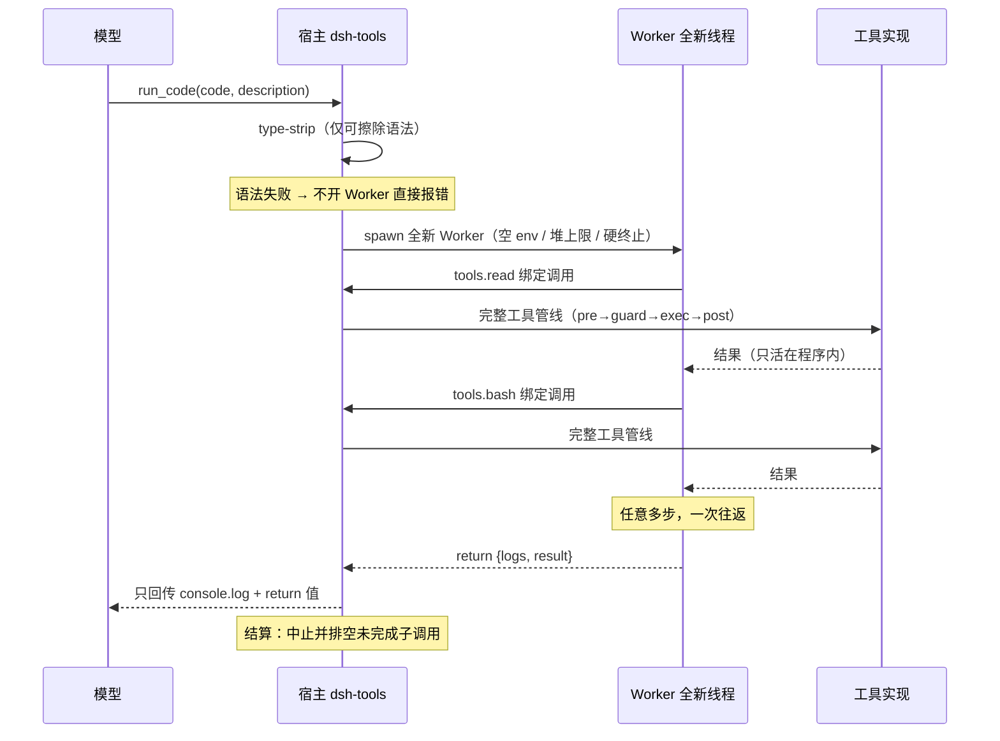

# 第 8 篇 · DSH 生产级参照

> **搭建路线**：第 8 块积木——不拼新模块，而是**对照**：看看生产级实现（DeepSeek Harness）怎么把前 7 篇的 9 块积木拼成产品。前 7 篇你搭的是"能跑的系统"，这一篇让你看懂"能生产的系统"。
> **本篇目标**：掌握 DSH 的 Cordis 插件系统、双平面架构、工具注册表与 PTC 模式，并建立"每块积木 ↔ DSH 组件"的参照映射。
> **难度**：⭐⭐⭐⭐
> **版本**：DSH 0.1.0-rc.6；源码引用为编译产物行号。

---

## 1. 参照总表：9 块积木 ↔ DSH 组件

前 7 篇搭的每块积木，DSH 都有生产级对应（这也是本篇的目录）：

| 你的积木 | DSH 组件 | 本篇小节 |
|---|---|---|
| Agent Loop | agent loop + LLM route（宿主平面） | §3 |
| LLM Client | 模型路由/多 Provider 由宿主组合管理 | §3 |
| Tool System | 工具注册表 `ctx.tools.register` + 呈现模式 | §4 |
| 上下文管理器 | compaction + tool-result-pruner + token-meter | §6 |
| 记忆系统 | goal + skills + 持久会话 | §7 |
| 规划模块 | plan mode | §7 |
| 反思模块 | ToolCallError 回填 + 失败注入上下文 | §4 |
| 缓存管理器 | 提示词段顺序稳定 + PTC SDK 字节确定 | §5 |
| 安全与可观测 | 沙箱 + 审批栈 + 事件流 | §7 |

> **总纲认知**：DSH 的配置 = Cordis 插件组合。能力 = 插件行，隔离 = realm/isolate，拆卸 = Fiber 生命周期。"一切皆插件"不是口号，是字面意义。

## 2. 双平面架构：设施与租户的分离

DSH 把插件行分成两个平面——这是理解整个项目的第一把钥匙：

| 平面 | 内容 | 判据 |
|---|---|---|
| **宿主组合**（base + web.cordis.yml） | 工具注册表本身、文件系统策略、沙箱、审批栈、持久化、模型路由、token 计量 | 跨会话共享的东西；注入发生在会话存在之前 |
| **Agent 预设**（agent.cordis.yml） | 该会话的工具行、persona、提示词段、能力开关 | 只属于一个会话的东西 |

> **餐厅类比**：宿主组合是厨房（煤气、水、电、锅碗——所有桌子共享的设施），预设是菜单（每桌客人点的菜不同）。厨房不能因为某桌换了菜单就重装燃气管道；菜单也不能自己决定"不用厨房的锅"。**设施全局唯一，菜单按桌定制**——这就是双平面，也是一个进程安全跑多个不同预设会话的原因。

**为什么预设里的服务必须隔离**（源码注释原文）："A service row here MUST sit inside a group carrying an isolate realm. Without one it publishes into the root realm, where it is process-global…"——预设里注册服务必须放在带 isolate 领域的分组里，否则泄漏成进程级，多个预设挂载时互相冲突。

```yaml
# agent.cordis.yml 骨架（概念示意）
- id: persona            # 人设提示词
  name: '@deepseek-ai/dsh-persona'
- id: tool-bash          # shell 工具
  name: '@deepseek-ai/dsh-tool-bash'
- id: planning           # 计划模式（entry-local realm）
  name: cordis:group
  group: true
  isolate: { planMode: true }
  config: [ { id: plan-mode, name: '@deepseek-ai/dsh-plan-mode' } ]
- id: tool-presentation  # ★ PTC 开关（第 5 节）
  name: '@deepseek-ai/dsh-agent-tool-presentation'
  config: { mode: code }
```

## 3. Cordis：插件生命周期与作用域

Cordis（`@deepseek-ai/cordis`，DSH 的发行包）解决的核心问题：一个进程里几十个插件如何优雅组合、隔离、拆卸。

| 概念 | 作用 | 对应你的积木 |
|---|---|---|
| `Context` | 依赖容器根 | 你的 `messages` + 全局状态 |
| `ctx.plugin()` | 启动插件，返回 `Fiber` | 加载一个能力模块 |
| `Fiber` | 插件生命周期单元 | ——（你还没有的：**卸载即清理一切副作用**） |
| `realm/isolate` | 作用域隔离 | ——（你还没有的：多会话互不污染） |

**Fiber 生命周期托管是 Cordis 最值钱的设计**：插件注册的副作用（事件监听、定时器、服务、工具）全部挂在它的 Fiber 上，dispose 时一次性回收。这让"动态装/卸能力"变安全——DSH 的创造模式能热插拔插件，全靠它。对照你的 35 行循环：你手动 append 消息、手动管理工具列表；生产级是"装了什么、卸了什么、隔离在哪"都有生命周期保证。

**Cordis 官方最小示例**（完整可跑——注意 inject 声明依赖、fiber.dispose 一次性回收）：

```ts
import { Context, Service } from 'cordis'

class Counter extends Service {
  value = 0
  constructor(ctx: Context) { super(ctx, 'counter') }
  next() { return ++this.value }
}

const greeter = Object.assign((ctx: Context) => {
  ctx.on('app/ready', (message) => {
    ctx.logger.info('%s #%d', message, ctx.counter.next())
  })
}, { inject: ['counter'] })   // ★ 声明依赖：counter 必须已存在

const root = new Context()
await root.plugin(Counter)    // ★ 启动插件
await root.plugin(greeter)
root.emit('app/ready', 'started')
await root.fiber.dispose()    // ★ 销毁：所有副作用自动清理
```

**Realm（领域）与 isolate**：普通插件系统的噩梦是"卸载插件 A 时永远不知道它注册了什么"。Cordis 的做法：所有副作用挂在 Fiber 上，dispose 一次回收。而 `isolate` 领域让同一预设的多会话互不污染（第 3 篇的餐厅类比：每桌客人的菜单独立）。

## 4. 工具注册表：契约的生产形态

你在第 3 篇手写的 TOOLS 数组，DSH 的生产形态是工具注册表（`dsh-tools` 的 `ToolRuntime`）：

- `ctx.tools.register(definition)`：**必须带规范输出契约**（output schema），缺失即注册失败——"契约是强制"而非"建议"；
- `tools.restrict(filter)`：agent 作用域的 allow/deny 掩码——可见性控制是工具系统的一部分；
- `presentAs(mode)`：工具的**呈现模式**——native（函数定义）/ code（SDK）/ both，见 §5。

工具失败的生产形态：**`ToolCallError`（只含 toolName + message）** 抛回调用方——错误信息会进入上下文，模型据此自我纠正（第 2 篇"错误进循环"的工程化）。

## 5. PTC 模式：把"35 行循环的每轮往返"压成"一次程序执行"

PTC 模式是 DSH 最"先进"的地方——也是第 2 篇那个 35 行循环的工程化重构。它把工具呈现层整体替换：模型不再逐轮发 tool_calls，而是写一个 TypeScript 程序，一次执行多步操作。**循环语义不变（模型请求动作、宿主执行、观察回填），工程形态变（程序内子调用）**。

### 5.1 SDK 生成（tools:sdk）

在 code 模式下，提示词里插入按当前会话工具集**实时生成**的 TypeScript SDK（注册为 tools:sdk，order 150）。生成器 `renderToolsSdk`（dsh-tools/lib/index.js:1607）：**按工具名字典序输出、字节级确定**——同一工具集永远生成逐字节相同的文本（KV 缓存命中的工程极致，第 1 篇 §6 的落地）。

### 5.2 唯一入口与"塌缩"（collapse）

规则（tools:code-only，order 99）：只有 `run_code` 可直接调用。**强制执行**：模型直连其他工具 → `UNKNOWN_TOOL`（在预执行、审批、guard 之前拦截，错误指回正确用法）。判定（index.js:2975）：

```ts
collapses(name, scope, nested) {
  return !nested && this.modeFor(scope) === "code" && name !== "run_code";
}
```

关键在 `nested`：**SDK 内子调用**（程序里 `await tools.read(...)`）携带外层 `parent` token 被豁免——程序里可调任何可见工具，模型直连却不行。

### 5.3 执行运行时：一个程序 = 一个全新 Worker

- **每次运行全新 Node worker**（`worker_threads.Worker`）：程序的世界随 worker 消亡，无跨运行状态；
- **宿主侧 type-strip**（仅可擦除语法，enum/namespace 直接拒绝，连 worker 都不开）；
- **资源上限**：`computeMs: 60000`（忙时预算）/ `maxWallMs: 600000`（墙钟）/ `maxOutputBytes: 64MiB` / `maxOldGenerationSizeMb: 512`；
- **隔离姿态（官方原文）**："Containment, not a security boundary"——隔离而非安全边界：信任姿态与 bash 相当，但获得 bash 没有的进程隔离（独立 isolate、空环境、硬终止）。

### 5.4 子调用走完整工具管线 + 并发契约

程序里每个 `tools.xxx()` 都走完整管线（pre-execute → guards → execute → post-execute → result）。调度（index.js:1122 起）：`Promise.all` 中独立只读调用可重叠（默认 `maxParallelSubCalls: 10`），写操作排空队列单独执行；失败以 `ToolCallError` 抛回程序可 try/catch。

### 5.5 一次 run_code 的完整旅程



> **为什么省 token**：只有 `console.log` 行和最终 `return` 值回到模型上下文；中间每次工具调用的完整结果只在程序内部流动，永不进对话。**代价**：模型必须会写 TS 程序；单步操作反而多一层；调试看不到中间态。

## 6. 上下文管理参照：压缩、修剪、计量

| 第 4 篇六层 | DSH 实现 |
|---|---|
| ④ 启发式压缩 | `dsh-compaction-basic`：上下文近满时旧对话总结成摘要替换 |
| ④ 修剪 | `dsh-compaction-tool-result-pruner`：`thresholdChars: 8192`、`headChars: 4096`、`tailChars: 1024`（**不对称**：头部含结构、尾部含结论，中间最不重要） |
| ② 计量 | `dsh-token-meter`：浏览器显示每个会话上下文用量 |
| ① 前缀稳定 | tools:sdk 字节确定 + 提示词段顺序固定 |

## 7. 记忆、规划、安全参照

| 你的积木 | DSH 组件 | 要点 |
|---|---|---|
| 记忆（第 5 篇） | `goal`（持久化长目标跨轮续跑）、`skills`（SKILL.md 按需加载=程序性记忆）、持久会话 | 会话状态按 Session 键控 |
| 规划（第 6 篇） | plan mode：先只读探索 → 计划 → exit_plan_mode 提交审批 → 才允许实现 | 覆盖 Review 闸门一环 |
| 安全（第 9 篇展开） | 三层：文件策略（如 workspace-write）/ 命令沙箱 / 审批栈（**拒绝即终局**：不得换方式绕过——防权限试探） | 事件流支撑审计 |

## 8. 四个内置预设：读真实配置学架构

预设目录：`config/agent-presets/`。四个预设的配置差异本身就是最好的架构教材。

| 预设 | 一句话 | 差异核心 |
|---|---|---|
| 标准模式 | 功能完整的编码 Agent | 标准工具集 + 计划/目标/压缩/子代理/工作流 |
| **PTC 模式** | 标准能力 + Code Mode SDK | 只差 `tool-presentation` 一行 `mode: code` |
| 极简模式 | 只有持久 bash + str_replace_editor | persona `complete: true`（锁死提示词）+ 无压缩 |
| 创造模式 | 能"改装自己"的预设 | 自引用 Cordis 工具集（cordis_inspect/define/run/stop/undefine） |

**极简模式的真实配置揭示了两个技巧**：

```yaml
# minimal/agent.cordis.yml（节选，真实内容）
- id: persona
  name: '@deepseek-ai/dsh-persona'
  config:
    text: You are a helpful software engineer assistant.
    complete: true                 # ★ 完整提示词：别人不能再加
    includeRuntimeContext: false   # ★ 不带运行时上下文快照
```

**创造模式**（cordis 预设）= 标准模式 + 自引用工具集。官方 TRUST 警告（原文）："Treat a session on this preset as shell access"——**创造模式 = shell 权限**，能在运行时定义/启动/停止插件，用于"让 Agent 造另一个 Agent"。

> 安全警告：不要在不可信环境开启创造模式。

## 9. 动手实验（读源码不如跑起来）

1. **观察"中间结果不进上下文"**：PTC 会话里一个程序同时 read/grep/bash 多个文件，只 return 摘要——对话里只有你的 return 值；
2. **观察 UNKNOWN_TOOL 塌缩**：PTC 会话里直接调 bash（不经 run_code）——失败信息指回"只能调 run_code"；
3. **对比四个预设**：标准/PTC/极简/创造对同一任务各跑一遍，看能力面的差异；
4. **用 cordis_inspect 看运行时**：创造模式会话里调 `cordis_inspect`——当前进程的所有服务、存活 fiber、已注册工具——"一切皆插件"的活体解剖；
5. **读预设猜差异**：对比 standard 与 code 的 agent.cordis.yml——差异就是 `tool-presentation` 一行 `mode: code`。

## 10. 动手实验清单（读源码不如跑起来）

1. **观察"中间结果不进上下文"**：PTC 会话里一个程序同时 read/grep/bash 多个文件，只 return 摘要——对话里只有你的 return 值；
2. **观察 UNKNOWN_TOOL 塌缩**：PTC 会话里直接调 bash（不经 run_code）——失败信息指回"只能调 run_code"；
3. **对照四个预设**：标准/PTC/极简/创造对同一任务各跑一遍，看能力面的差异；
4. **读预设猜差异**：对比 standard 与 code 的 agent.cordis.yml——差异就是 tool-presentation 一行 `mode: code`。

## 11. 检验：读完本篇，你能回答吗

1. 9 块积木 ↔ DSH 组件各对应什么？（任举 5 个）
2. 双平面怎么分？为什么预设里的服务必须放 isolate 领域？
3. Fiber 生命周期托管解决什么问题？
4. PTC 的"塌缩"机制：模型直连工具为什么被拒？SDK 内子调用为什么豁免？
5. 为什么 worker 隔离是"containment 而非 security boundary"？
6. 标准 → PTC 的预设差异具体是哪一行？
7. 极简模式的 complete: true 是什么意思？创造模式为什么等于 shell 权限？
8. Cordis 的 Fiber dispose 解决什么问题？isolate 领域防什么？

## 本章小结

第 8 篇看完了生产级拼法：插件化组装（Cordis）、设施/租户分离（双平面）、契约强制（注册表）、效率极致（PTC）。但你自己的系统还散在代码里——下一篇把它们组织成一个真正的产品：AutoResearcher。

**下一篇**：[第 9 篇 · 企业实战：AutoResearcher](09-企业实战-AutoResearcher.md) —— 把 9 块积木组装成可部署的科研 Agent。