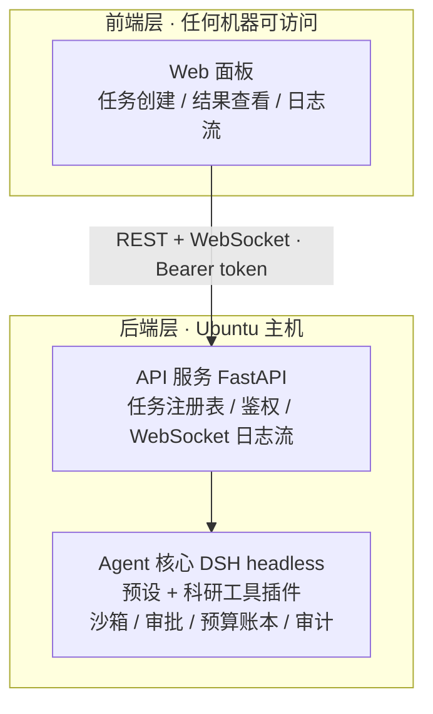

# 第 9 篇 · 企业实战：AutoResearcher

> **搭建路线**：最后一块积木——把前 8 篇的 9 块积木组装成一个**可部署、可维护、带安全治理/可观测/评测/CI** 的企业级产品：AutoResearcher 科研 Agent。前后端分离、后端部署在 Ubuntu 远程主机。
> **本篇目标**：掌握企业级项目的决策链（非目标/事故清单/契约/评测/部署）；完整工程代码在 `../autoresearcher/`（v1.13.0，全部通过真实测试）。
> **难度**：⭐⭐⭐⭐⭐

---

## 1. 立项：为什么"非目标"清单最重要

科研 Agent 的三大场景：**文献调研、实验运行、数据分析**。每个都写进需求文档，但真正决定项目成败的是**非目标**：

```text
非目标（明确不做）：
- 不做实验设计决策（Agent 提方案，人拍板）
- 不自动部署/训练大模型（只编排已有脚本）
- 不联网乱跑代码（沙箱内运行，高危操作审批）
- 不做论文代写（只辅助片段与图表）
```

**为什么"不做什么"比"做什么"重要？** Agent 的不可控性主要来自范围模糊。把非目标写清楚，预设里就**不给它那些工具**——没有工具 = 做不了，这是比任何提示词都硬的控制（第 3 篇的"不给工具 = 最强控制"在企业级落地）。

## 2. 架构：前后端分离三层



**三条设计原则**：前端不碰 Agent（所有交互走后端 API）；Agent 核心是**子进程**（`spawn dsh --profile headless "任务"`，任务崩溃不影响服务，日志落盘可审计）；远程部署 = 进程托管（Docker/systemd 管生命周期，Nginx 管静态托管与反代）。

> **外卖平台类比**：前端面板是点餐 App，后端 API 是平台服务器，Agent 核心是商家厨房。App 永远不直接进厨房——所有下单、状态、出餐都经过平台；厨房可以换（换预设/换模型），App 不用改。**分离的本质是"谁跟谁说话"的约定（契约表），而不是代码在哪个目录**。

## 3. 预设：Agent 的能力面 = 一个文件

```yaml
# agent/agent.cordis.yml（AutoResearcher 预设，裁剪自标准模式）
- id: persona
  name: '@deepseek-ai/dsh-persona'
  config:
    text: >-
      You are AutoResearcher... You NEVER design experiments autonomously.
      Critical operations (running experiments) require approval.

- id: tool-fs
  name: '@deepseek-ai/dsh-tool-fs'          # 只读能力

- id: research-tools
  name: '@autoresearcher/plugin-research'   # 科研业务工具（§4）

- id: planning
  name: cordis:group
  group: true
  isolate: { planMode: true }
  config: [ { id: plan-mode, name: '@deepseek-ai/dsh-plan-mode' } ]

# 注意：故意【不】注册写工具（write/edit）与自由 shell
# —— 没有工具 = 做不了 = 最强的范围控制
```

**企业级要点**：预设要版本化（进 Git），每次改动跑一遍 §7 的评测集，确认能力面没有悄悄变差。预设就是产品的"能力面"：这个 Agent 能碰什么、不能碰什么，答案全在这一个文件里。

## 4. 自定义工具：契约三层 + 安全三铁律

以最危险的工具 `run_experiment` 为例（完整代码见 `../autoresearcher/plugin/`）：

**契约三层**（第 3 篇 §2）：parameters（模型能传什么：script/timeoutSec，additionalProperties: false）→ output（模型能拿到什么：exitCode/tail/logPath/timedOut）→ 实现层（内部细节）。

**实现三铁律**（每条对应一个真实事故场景）：

```ts
// 铁律 1：路径必须解析后仍落在白名单根内（防 ../ 逃逸 → 防任意命令执行）
if (relative(SCRIPTS_ROOT, full).startsWith('..')) throw new Error('脚本必须在 data/scripts/ 下')
// 铁律 2：强制超时 + SIGKILL 进程树（防实验失控吃满 GPU）
const timer = setTimeout(() => child.kill('SIGKILL'), timeoutSec * 1000)
// 铁律 3：日志全量落盘（审计 + 可复现："这台 Agent 跑过什么"可回答）
writeFileSync(logPath, Buffer.concat(chunks).toString('utf8'))
```

**资源治理**（科研场景的硬约束）：预算账本（data/ledger.json，跨天滚动）+ 四重熔断（实验数/时长/磁盘/GPU 显存）——先列事故清单再设计防线。

## 5. 安全与治理：先列事故清单，再设计防线

| 事故 | 防线 |
|---|---|
| 模型读走凭据（.ssh/.aws/.env） | fs 策略 deny 凭据目录 |
| 模型被诱导执行任意命令 | 脚本白名单 + 高危命令拦截 |
| 模型删数据 | 不注册删除类工具 + 沙箱只写 data/ |
| 实验失控吃满 GPU | 强制超时（SIGKILL）+ 资源熔断 |
| 越权操作 | 审批栈：**拒绝即终局**（不得换方式绕过） |
| 出事说不清 | 审计：工具调用全量落盘 + 实验日志全量留存 |

**"拒绝即终局"为什么重要**：如果允许"换个方式重试"，模型可以无限试探权限边界——这正是提示词注入攻击的核心手法。终局语义把试探成本变成零收益。

## 6. 可观测性与成本

**可观测三件套**：日志（工具调用参数摘要与状态）、指标（token/时长/失败率按任务聚合）、追踪（一次任务 = 一条 trace）。

**成本控制的两个杠杆**（按收益排序）：① **上下文裁剪是最大的杠杆**（文献任务先检索摘要、只精读相关论文的摘要+结论页）；② **模板化实验脚本**（Agent 只填参数不写新脚本——既省 token 又更安全）。

> 企业铁律：**没有成本上限的 Agent 项目，会在第一个月被账单教做人**。评测里固定断言"单任务输入 token ≤ N"，超了算回归失败。

## 7. 评测体系：没有评测的 Agent 等于没有测试的软件

两层评测：**工具级单测**（管正确性：边界/失败路径/安全约束）+ **端到端评测**（管任务完成度：manifest 驱动 + grader 评分 + 预算门禁）。

```jsonc
// evals/manifest.json（示意：一个用例）
{
  "id": "lit-kv-cache-survey",
  "task": "检索 3 篇关于 KV cache 优化的论文，输出标题与链接",
  "graders": [                                    // ← 评分函数：声明式
    { "type": "json-path", "path": "$.papers[0].link", "mustMatch": "arxiv.org" },
    { "type": "count", "path": "$.papers", "min": 3 }
  ],
  "budget": { "maxInputTokens": 15000 }           // ← 成本也是指标
}
```

跑批核心逻辑一句话：**通过率 ≥ 90% 且预算合规才 exit 0**。

**为什么"模型升级必须跑评测"**：模型供应商静默升级后，同一提示词的输出分布会变——可能悄悄变笨。评测是唯一能察觉"悄悄变笨"的机制。这是 2026 年生产 Agent 团队踩坑最多的点。

## 8. CI/CD 与 Ubuntu 部署

**CI 流水线**（GitHub Actions）两个 job：`test`（单测/构建/冒烟，每次 push）和 `eval`（评测门禁，tag 或手动，需 API key）。核心思路：**代码改动过 test，能力改动过 eval，发布过两者**。

**Ubuntu 托管两方案**（原理：进程生命周期管理）：

```yaml
# 方案 A：Docker Compose（推荐）—— 镜像=版本化部署单元（可回滚）
services:
  backend:  { build: ./backend, ports: ["8000:8000"], restart: unless-stopped }
  frontend: { image: nginx:alpine, volumes: ["./frontend/dist:/usr/share/nginx/html:ro"] }
```

```ini
# 方案 B：systemd —— 免 Docker 的轻量选择
[Service]
User=researcher
EnvironmentFile=/opt/autoresearcher/.env    # API key 不入库
ExecStart=/usr/bin/python3 backend/server.py
Restart=on-failure
```

**为什么 Docker 优先**：镜像 = 版本化的部署单元（可回滚）；`restart: unless-stopped` = 崩溃自愈；volume 挂载 = 数据持久化与镜像解耦。

## 9. 前后端分离：契约表 + 两个核心决策

验收标准：**停掉前端，用 curl 直接调后端 API 应该完全可用**——前端只是 API 的一个消费者。

```text
POST   /api/tasks              创建任务    req: {task, profile?} → {taskId, status}
GET    /api/tasks              任务列表    → [{taskId, status, createdAt}]
GET    /api/tasks/{id}         状态+日志   → {taskId, status, logTail}
GET    /api/tasks/{id}/result  结构化结果  → {report}（前端/评测消费）
WS     /api/ws/{id}            日志流      msg: {type: log|status|ping}
GET    /api/health             健康检查    → {ok, version}
# 鉴权：所有请求头 Authorization: Bearer <token>
```

后端核心三个决策（30 行）：

```python
@app.post("/api/tasks", dependencies=[Depends(auth)])   # 决策1：统一鉴权
def create_task(req: TaskRequest):
    task_id = uuid.uuid4().hex[:8]
    log_path = TASK_DIR / f"{task_id}.log"
    proc = subprocess.Popen(                            # 决策2：Agent 是子进程
        [DSH_BIN, "--profile", req.profile or "headless", req.task],
        stdout=open(log_path, "w"), stderr=subprocess.STDOUT)
    tasks[task_id] = {"status": "running", "proc": proc, "createdAt": time.time()}
    threading.Thread(target=_collect_result,            # 决策3：退出后收结果
                     args=(task_id, proc, log_path), daemon=True).start()
    return {"taskId": task_id, "status": "running"}
```

> 完整工程（backend/plugin/frontend/evals/deploy + 文档四件套）在 `../autoresearcher/`，全部通过真实测试：pytest 10/10、vitest 22/22、tsc 0 error、冒烟 5/5、compose config 校验。

## 10. 检验：读完本篇，你能回答吗

1. 为什么"不给工具"是最强控制？非目标清单如何落地成预设？
2. 安全设计的正确顺序？三条铁律各防什么事故？
3. "拒绝即终局"防的是什么攻击手法？
4. 为什么模型升级必须跑评测？
5. 前后端分离的验收标准是什么？后端三个决策是什么？

## 本章小结

第 9 篇把 9 块积木组装成了产品：需求定边界、预设定能力、工具定安全、评测防退化、部署管生命周期。到这一步，你已经从"看懂图纸"走到了"交付产品"。最后一篇，看看这条路的前方。

**下一篇**：[第 10 篇 · 前沿与学习路线](10-前沿与学习路线.md) —— MCP 深入、多 Agent、评测前沿、3 个月路线图。
